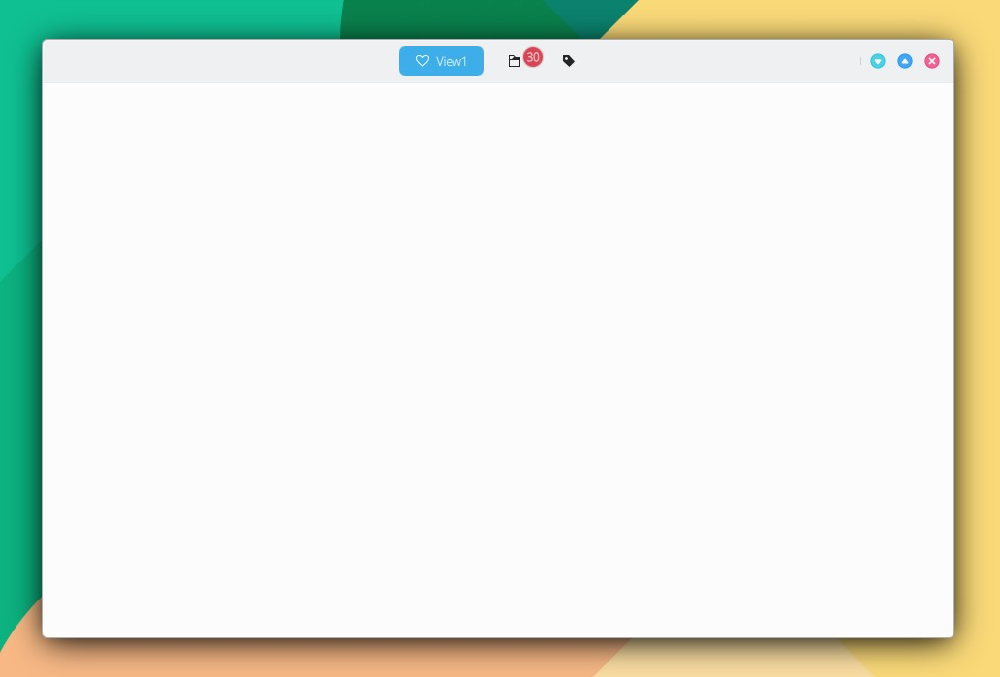

# AppViews

```
import QtQuick 2.15
import QtQuick.Controls 2.15
import org.mauikit.controls 1.3 as Maui

Maui.ApplicationWindow
{
    id: root

    Maui.AppViews
    {
        id: _page
        anchors.fill: parent

        showCSDControls: true
        headBar.forceCenterMiddleContent: true

        Rectangle
        {
            Maui.AppView.title: "View1"
            Maui.AppView.iconName: "love"

            color: Maui.Theme.backgroundColor
        }

        Rectangle
        {
            Maui.AppView.title: "View2"
            Maui.AppView.iconName: "folder"
            Maui.AppView.badgeText: "30"
            color: Maui.Theme.backgroundColor
        }

        Rectangle
        {
            Maui.AppView.title: "View3"
            Maui.AppView.iconName: "tag"

            color: Maui.Theme.backgroundColor
        }
    }
}
```

<figure><figcaption></figcaption></figure>

## Propiedades


