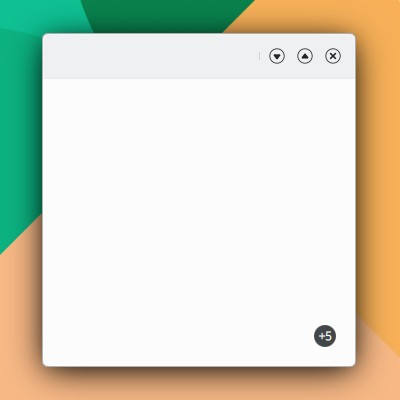

# Badge

```
import QtQuick 2.15
import QtQuick.Controls 2.15
import org.mauikit.controls 1.3 as Maui

Maui.ApplicationWindow
{
    id: root

    Maui.Page {
        anchors.fill: parent

        showCSDControls: true

        Maui.Badge
        {
            anchors.right: parent.right
            anchors.bottom: parent.bottom
            anchors.margins: 20
            text: "+5"
        }
    }
}
```

<figure><figcaption></figcaption></figure>
