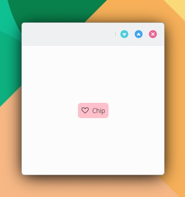

# Chip

```
import QtQuick 2.15
import QtQuick.Controls 2.15
import org.mauikit.controls 1.3 as Maui

Maui.ApplicationWindow
{
    id: root

    Maui.Page {
        anchors.fill: parent

        showCSDControls: true

        Maui.Chip
        {
            anchors.centerIn: parent
            color: "pink"
            icon.name: "love"
            text: "Chip"
        }
    }
}

```

<figure><figcaption></figcaption></figure>

## Propiedades


