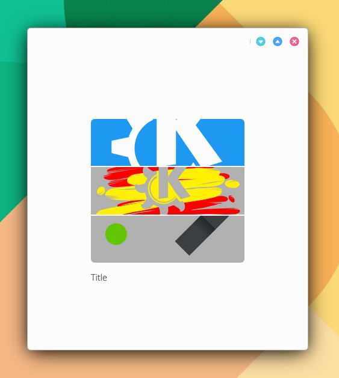

# CollageItem

```
import QtQuick 2.15
import QtQuick.Controls 2.15
import org.mauikit.controls 1.3 as Maui

Maui.ApplicationWindow
{
    id: root

    Maui.Page {
        anchors.fill: parent

        showCSDControls: true

        headBar.background: null

        Maui.CollageItem
        {
            anchors.fill: parent
            anchors.margins: 100
            implicitWidth: 200
            implicitHeight: 200
            images: ["https://upload.wikimedia.org/wikipedia/commons/8/8d/KDE_logo.svg", "https://upload.wikimedia.org/wikipedia/commons/c/c5/AKademy_2005_logo.svg", "https://upload.wikimedia.org/wikipedia/commons/d/d7/Plasma_coloured_logo.svg"]
            label1.text: "Title"
            checkable: false
            checked: false
        }
    }
}

```

<figure><figcaption></figcaption></figure>

## Propiedades


