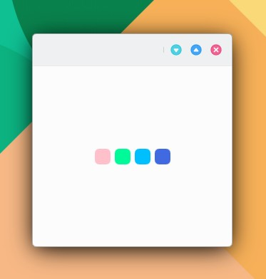

# ColorsRow

```
import QtQuick 2.15
import QtQuick.Controls 2.15
import org.mauikit.controls 1.3 as Maui

Maui.ApplicationWindow
{
    id: root

    Maui.Page {
        anchors.fill: parent

        showCSDControls: true

        Maui.ColorsRow
        {
            anchors.centerIn: parent
            colors: ["pink", "mediumspringgreen", "deepskyblue", "royalblue"]
        }
    }
}

```

<figure><figcaption></figcaption></figure>

## Propiedades


