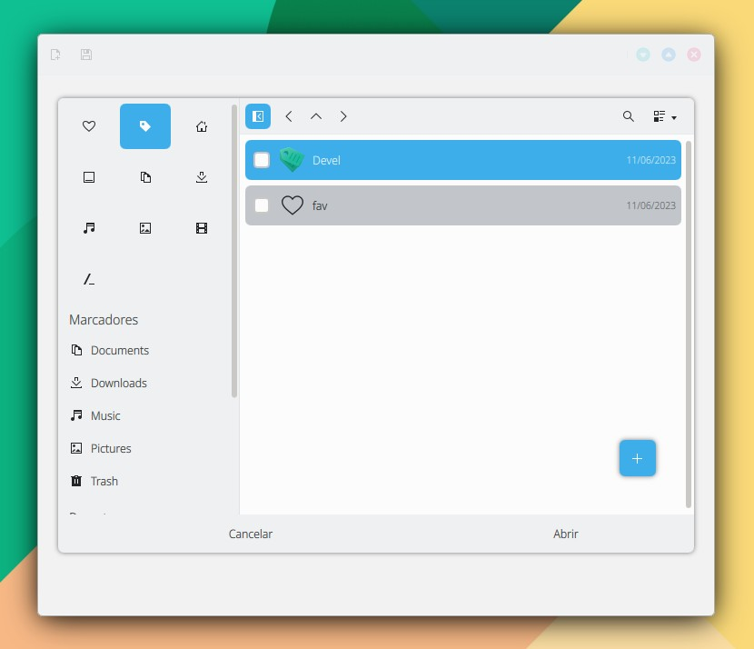
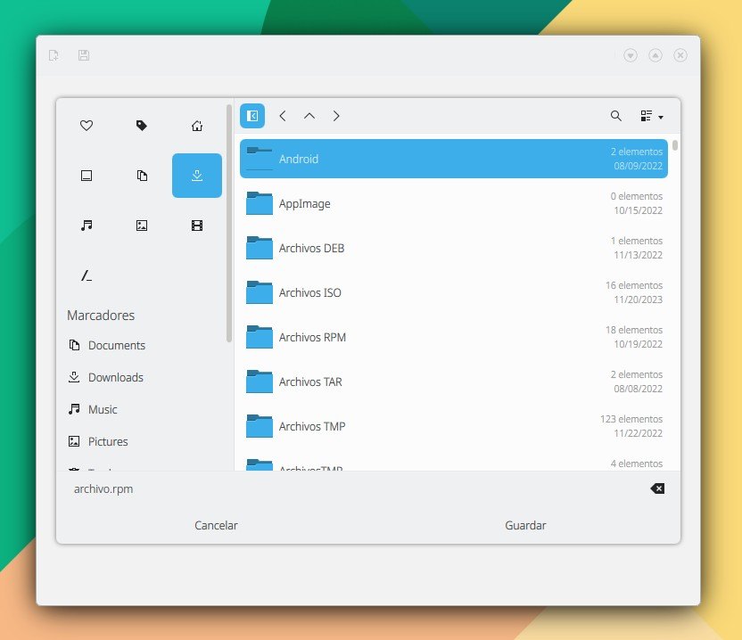
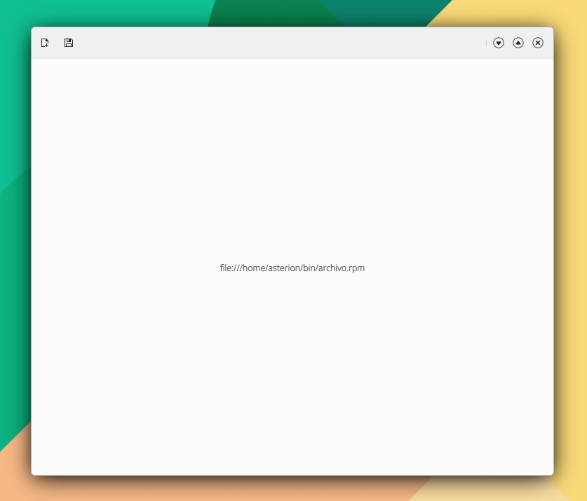

# FileDialog

```
import QtQuick 2.15
import QtQuick.Controls 2.15
import org.mauikit.controls 1.3 as Maui
import org.mauikit.filebrowsing 1.3 as FB

Maui.ApplicationWindow
{
    id: root

    Maui.Page
    {
        showCSDControls: true
        anchors.fill: parent

        headBar.farLeftContent: ToolButton {
            icon.name: "document-single"
            onClicked: {
                dialog.openMode = true
                dialog.open()
            }
        }

        headBar.leftContent: ToolButton {
            icon.name: "document-save"
            onClicked: {
                dialog.openMode = false
                dialog.open()
            }
        }

        Label {
            id: label
            anchors.centerIn: parent
        }
    }

    FB.FileDialog
    {
        id: dialog
        property bool openMode
        mode: openMode? modes.OPEN : modes.SAVE

        onFinished: {
            var url = urls
            label.text = url.toString()
        }
    }
}

```

<figure><figcaption></figcaption></figure>

<figure><figcaption></figcaption></figure>

<figure><figcaption></figcaption></figure>

## Propiedades


