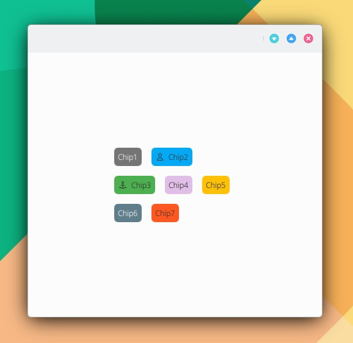

# Flow

```
import QtQuick 2.15
import QtQuick.Controls 2.15
import org.mauikit.controls 1.3 as Maui

Maui.ApplicationWindow
{
    id: root

    Maui.Page {
        anchors.fill: parent

        showCSDControls: true

        Flow
        {
            width: 200
            anchors.centerIn: parent
            spacing: Maui.Style.space.big

            Maui.Chip
            {
                text: "Chip1"
                color: "#757575"
            }

            Maui.Chip
            {
                text: "Chip2"
                icon.name: "actor"
                color: "#03A9F4"
            }

            Maui.Chip
            {
                text: "Chip3"
                icon.name: "anchor"
                color: "#4CAF50"
            }

            Maui.Chip
            {
                text: "Chip4"
                color: "#E1BEE7"
            }

            Maui.Chip
            {
                text: "Chip5"
                color: "#FFC107"
            }

            Maui.Chip
            {
                text: "Chip6"
                color: "#607D8B"
            }

            Maui.Chip
            {
                text: "Chip7"
                color: "#FF5722"
                icon.source: "/home/camiloh/Downloads/5911329.jpeg"
            }
        }
    }
}
```

<figure><figcaption></figcaption></figure>

## Propiedades



####
