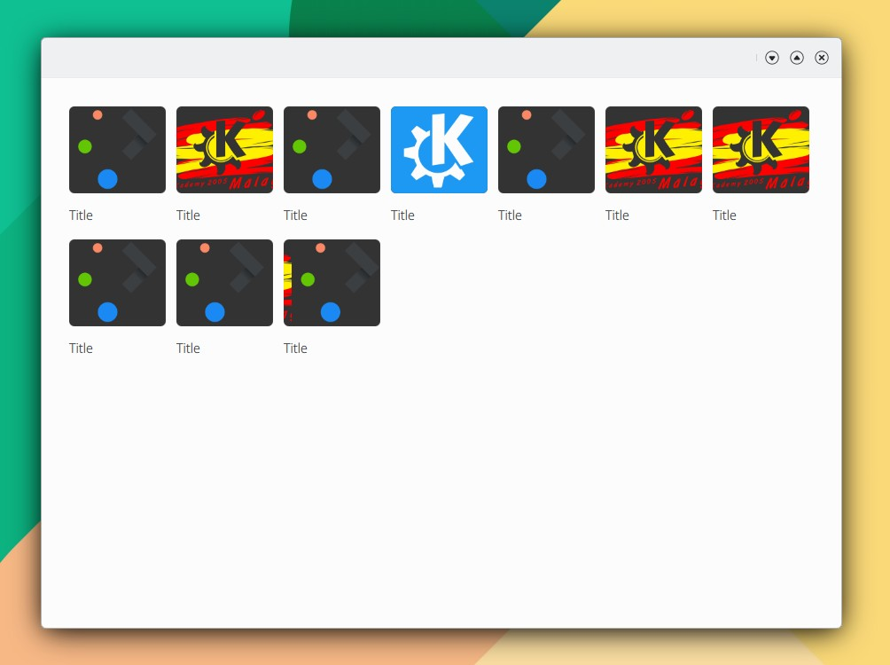

# GalleryRolItem

```
import QtQuick 2.15
import QtQuick.Controls 2.15
import org.mauikit.controls 1.3 as Maui

Maui.ApplicationWindow
{
    id: root

    Maui.Page {
        anchors.fill: parent

        showCSDControls: true

        Maui.GridBrowser {
            anchors.fill: parent
            anchors.margins: 20
            itemSize: 120
            itemHeight: 150
            adaptContent: true
            horizontalScrollBarPolicy: ScrollBar.AlwaysOff
            verticalScrollBarPolicy: ScrollBar.AlwaysOff

            model: 10

            delegate: Rectangle {
                color: "transparent"
                width: GridView.view.cellWidth
                height: GridView.view.cellHeight
                Maui.GalleryRollItem
                {
                    anchors.fill: parent
                    images: ["https://upload.wikimedia.org/wikipedia/commons/8/8d/KDE_logo.svg", "https://upload.wikimedia.org/wikipedia/commons/c/c5/AKademy_2005_logo.svg", "https://upload.wikimedia.org/wikipedia/commons/d/d7/Plasma_coloured_logo.svg"]
                    label1.text: "Title"
                    checkable: false
                    checked: false
                }
            }
        }
    }
}

```

<figure><figcaption></figcaption></figure>

{% embed url="https://files.gitbook.com/v0/b/gitbook-x-prod.appspot.com/o/spaces%2FED1v8xhNFPWKlgOCuryr%2Fuploads%2FKhII9XD38pu9a9c0aVwx%2FControls-GalleryRollItem.mp4?alt=media&token=c6d6ee25-0336-4123-8123-d43fac9a66ab" %}

## Propiedades


