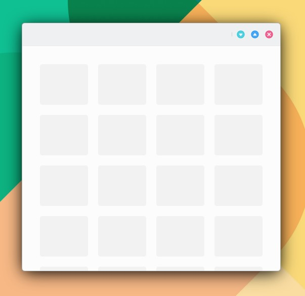
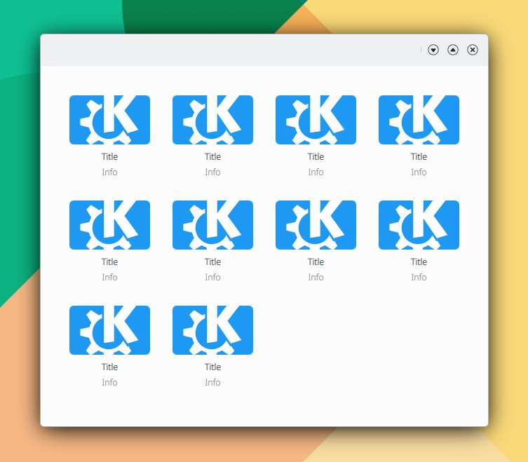

# GridBrowser

```
import QtQuick 2.15
import QtQuick.Controls 2.15
import org.mauikit.controls 1.3 as Maui

Maui.ApplicationWindow
{
    id: root

    Maui.Page {
        anchors.fill: parent

        showCSDControls: true

        Maui.GridBrowser {
            anchors.fill: parent
            anchors.margins: 20
            itemSize: 100
            itemHeight: 100
            adaptContent: true
            horizontalScrollBarPolicy: ScrollBar.AlwaysOff
            verticalScrollBarPolicy: ScrollBar.AlwaysOff

            model: 20

            delegate: Rectangle {
                color: "transparent"
                width: GridView.view.cellWidth
                height: GridView.view.cellHeight
                Rectangle {
                    anchors.fill: parent
                    anchors.margins: 10
                    radius: 4
                    color: Maui.Theme.alternateBackgroundColor
                }
            }
        }
    }
}
```

```
horizontalScrollBarPolicy: ScrollBar.AsNeeded, ScrollBar.AlwaysOn, ScrollBar.AlwaysOff
verticalScrollBarPolicy: ScrollBar.AsNeeded, ScrollBar.AlwaysOn, ScrollBar.AlwaysOff
```

<figure><figcaption></figcaption></figure>

## GridBrowserDelegate

```
import QtQuick 2.15
import QtQuick.Controls 2.15
import org.mauikit.controls 1.3 as Maui

Maui.ApplicationWindow
{
    id: root

    Maui.Page {
        anchors.fill: parent

        showCSDControls: true

        Maui.GridBrowser {
            anchors.fill: parent
            anchors.margins: 20
            itemSize: 120
            itemHeight: 150
            adaptContent: true
            horizontalScrollBarPolicy: ScrollBar.AlwaysOff
            verticalScrollBarPolicy: ScrollBar.AlwaysOff

            model: 10

            delegate: Rectangle {
                color: "transparent"
                width: GridView.view.cellWidth
                height: GridView.view.cellHeight
                Maui.GridBrowserDelegate
                {
                    anchors.fill: parent
                    anchors.margins: 10

                    checkable: false
                    checked: false

                    //iconSource: "folder"
                    imageSource: "https://upload.wikimedia.org/wikipedia/commons/8/8d/KDE_logo.svg"

                    label1.text: i18n("Title")
                    label2.text: i18n("Info")
                }
            }
        }
    }
}

```

<figure><figcaption></figcaption></figure>

## Propiedades




