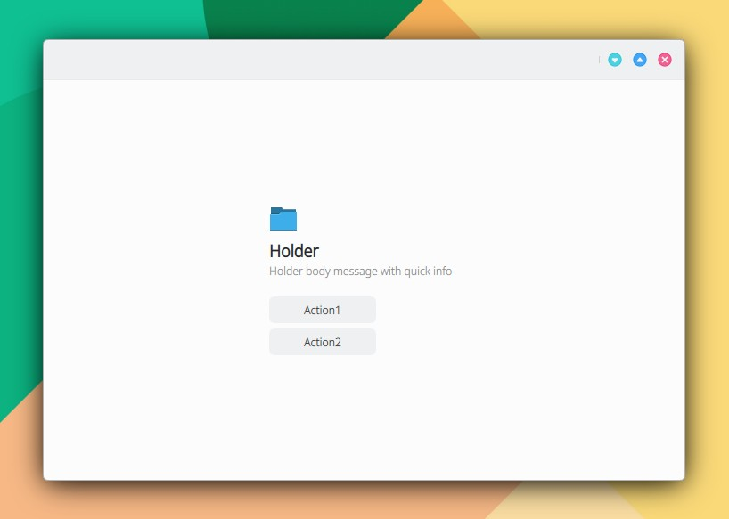

# Holder

```
import QtQuick 2.15
import QtQuick.Controls 2.15
import org.mauikit.controls 1.3 as Maui

Maui.ApplicationWindow
{
    id: root

    Maui.Page {
        anchors.fill: parent

        showCSDControls: true

        Maui.Holder
        {
            anchors.fill: parent
            title: i18n("Holder")
            body: i18n("Holder body message with quick info")
            emoji: "folder"
            isMask: false

            Action
            {
                text: "Action1"
            }
            Action
            {
                text: "Action2"
            }
        }
    }
}

```

<figure><figcaption></figcaption></figure>

## Propiedades


