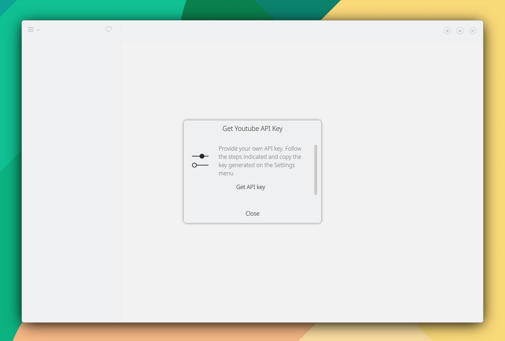

# InfoDialog

```
// En Maui.ApplicationWindow

Maui.InfoDialog
{
    id: infoDialog

    title: i18n("Get Youtube API Key")
    message: i18n("Provide your own API key. Follow the steps indicated and copy the key generated on the Settings menu")

    template.iconSource: "settings-configure"

    onAccepted: close()
    onRejected: close()

    Button {
        anchors.horizontalCenter: parent.horizontalCenter
        text: "Get API key"
        flat: true
        onClicked: {
            Qt.openUrlExternally("https://github.com/headsetapp/headset-electron/wiki/Get-Youtube-API-Key")
        }
    }
}

// En headBar.leftContent: Maui.ToolButtonMenu

MenuItem
{
    text: "API Key"
    icon.name: "database-change-key"
    onTriggered: infoDialog.open()
}
```

<figure><figcaption></figcaption></figure>
