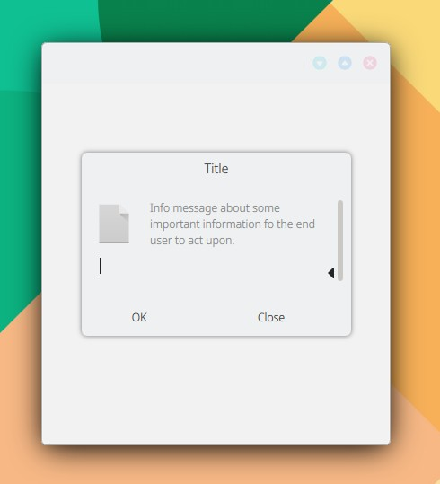

# InputDialog

```
import QtQuick 2.15
import QtQuick.Controls 2.15
import org.mauikit.controls 1.3 as Maui

Maui.ApplicationWindow
{
    id: root

    Maui.Page {
        anchors.fill: parent

        showCSDControls: true

        Maui.InputDialog
        {
            id: inputDialog

            title: "Title"
            message: i18n("Info message about some important information fo the end user to act upon.")
            template.iconSource: "dialog-info"
            standardButtons: Dialog.Ok | Dialog.Close

        }

        Button {
            anchors.centerIn: parent
            flat: true
            text: i18n("Open")
            onClicked: inputDialog.open()
        }
    }
}

```

<figure><figcaption></figcaption></figure>

## Propiedades


