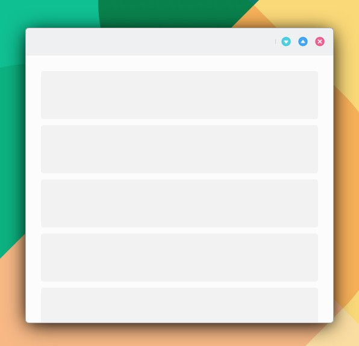

# ListBrowser

```
import QtQuick 2.15
import QtQuick.Controls 2.15
import org.mauikit.controls 1.3 as Maui

Maui.ApplicationWindow
{
    id: root

    Maui.Page {
        anchors.fill: parent

        showCSDControls: true

        Maui.ListBrowser {
            anchors.fill: parent
            anchors.margins: 20

            horizontalScrollBarPolicy: ScrollBar.AlwaysOff
            verticalScrollBarPolicy: ScrollBar.AlwaysOff

            spacing: 10

            model: 10

            delegate: Rectangle {
                color: "transparent"
                width: ListView.view.width
                height: 80
                Rectangle {
                    anchors.fill: parent
                    anchors.margins: 0
                    radius: 4
                    color: "pink"
                }
            }
        }
    }
}
```

```
horizontalScrollBarPolicy: ScrollBar.AsNeeded, ScrollBar.AlwaysOn, ScrollBar.AlwaysOff
verticalScrollBarPolicy: ScrollBar.AsNeeded, ScrollBar.AlwaysOn, ScrollBar.AlwaysOff
```

<figure><figcaption></figcaption></figure>

## Propiedades


