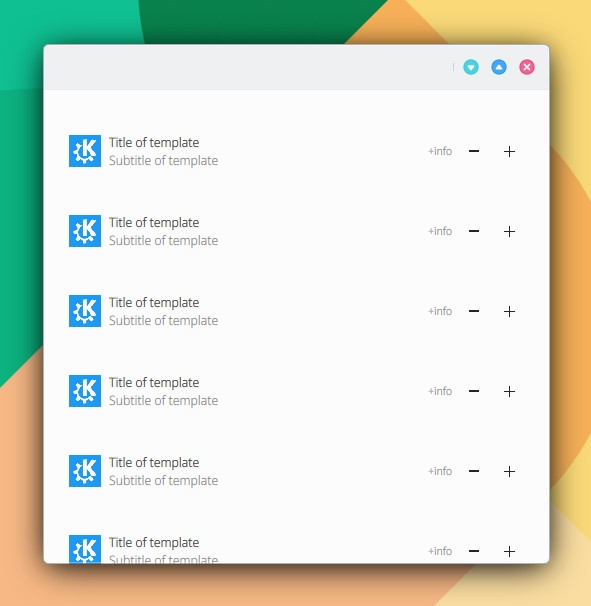

# ListItemTemplate

```
import QtQuick 2.15
import QtQuick.Controls 2.15
import org.mauikit.controls 1.3 as Maui

Maui.ApplicationWindow
{
    id: root

    Maui.Page {
        anchors.fill: parent

        showCSDControls: true

        Maui.ListBrowser {
            anchors.fill: parent
            anchors.margins: 20

            horizontalScrollBarPolicy: ScrollBar.AlwaysOff
            verticalScrollBarPolicy: ScrollBar.AlwaysOff

            spacing: 10

            model: 10

            delegate: Maui.ListItemTemplate
            {
                width: parent.width
                height: 70
                imageSource: "https://upload.wikimedia.org/wikipedia/commons/8/8d/KDE_logo.svg"
                //iconSource: "folder"
                label1.text: "Title of template"
                label2.text: "Subtitle of template"
                label3.text: "+info"

                ToolButton
                {
                    flat: true
                    icon.name: "list-remove"
                }
                ToolButton
                {
                    flat: true
                    icon.name: "list-add"
                }
            }
        }
    }
}

```


<figure><figcaption></figcaption></figure>

## Propiedades


