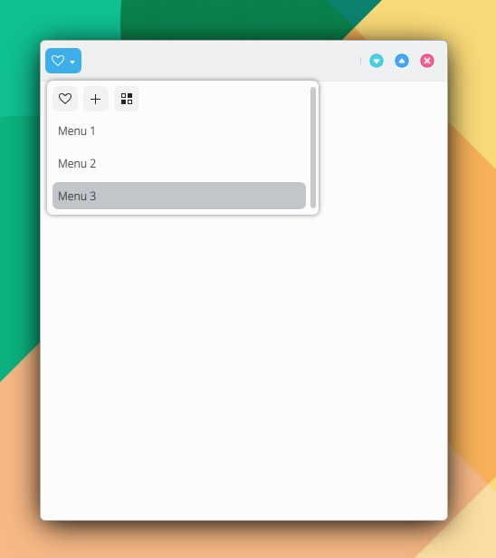

# MenuItemActionRow

```
import QtQuick 2.15
import QtQuick.Controls 2.15
import org.mauikit.controls 1.3 as Maui

Maui.ApplicationWindow
{
    id: root

    Maui.Page
    {
        anchors.fill: parent

        showCSDControls: true

        headBar.leftContent: Maui.ToolButtonMenu {

            icon.name: "love"

            Maui.MenuItemActionRow
            {
                Action
                {
                    icon.name: "love"
                }

                Action
                {
                    icon.name: "list-add"
                }

                Action
                {
                    icon.name: "view-list-icons"
                }
            }

            MenuItem
            {
                text: i18n("Menu 1")
            }

            MenuItem
            {
                text: i18n("Menu 2")
            }

            MenuItem
            {
                text: i18n("Menu 3")
            }
        }
    }
}

```

<figure><figcaption></figcaption></figure>

## Propiedades


