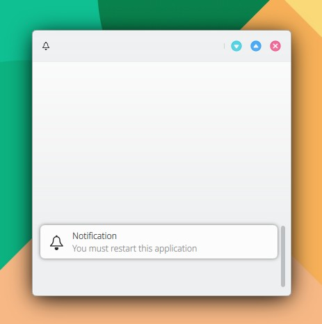

# Notify

```
import QtQuick 2.15
import QtQuick.Controls 2.15
import org.mauikit.controls 1.3 as Maui

Maui.ApplicationWindow
{
    id: root

    Maui.Page {
        anchors.fill: parent

        showCSDControls: true

        headBar.leftContent: ToolButton {
            icon.name: "notifications"
            onClicked: {
                root.notify("notifications","Notification","You must restart this application",null,5000,"Accept")
            }
        }
    }
}

```


<figure><figcaption></figcaption></figure>

## Propiedades


