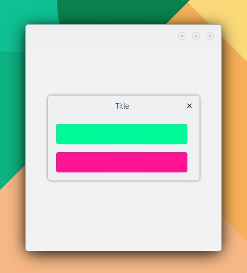

# PopupPage

```
import QtQuick 2.15
import QtQuick.Controls 2.15
import org.mauikit.controls 1.3 as Maui

Maui.ApplicationWindow
{
    id: root

    Maui.Page {
        anchors.fill: parent

        showCSDControls: true

        Maui.PopupPage
        {
            id: popupPage
            hint: 1

            title: i18n("Title")

            Rectangle
            {
                anchors.left: parent.left
                anchors.right: parent.right
                height: 40
                radius: 4
                color: "mediumspringgreen"
            }

            Rectangle
            {
                anchors.left: parent.left
                anchors.right: parent.right
                height: 40
                radius: 4
                color: "deeppink"
            }
        }

        Button
        {
            anchors.centerIn: parent
            flat: true
            text: i18n("Open")
            onClicked: popupPage.open()
        }

    }
}

```

<figure><figcaption></figcaption></figure>

## Propiedades


