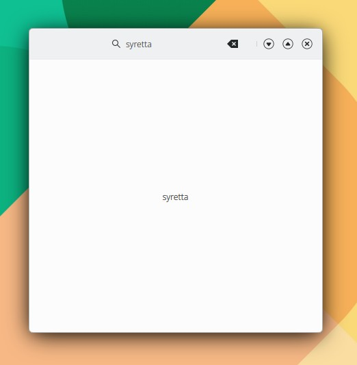

# SearchField

```
import QtQuick 2.15
import QtQuick.Controls 2.15
import org.mauikit.controls 1.3 as Maui

Maui.ApplicationWindow
{
    id: root

    property string query

    Maui.Page {
        anchors.fill: parent

        showCSDControls: true

        headBar.middleContent: Maui.SearchField
        {
            anchors.horizontalCenter: parent.horizontalCenter
            placeholderText: "Search for..."
            onAccepted: {
                query = text
            }
        }

        Label {
            id: label
            anchors.centerIn: parent
            text: query
        }
    }
}

```

```
// Opcionalmente

onAccepted: {
    label.text = text
}

Label {
    id: label
    anchors.centerIn: parent
}
```

<figure><figcaption></figcaption></figure>

## Propiedades


