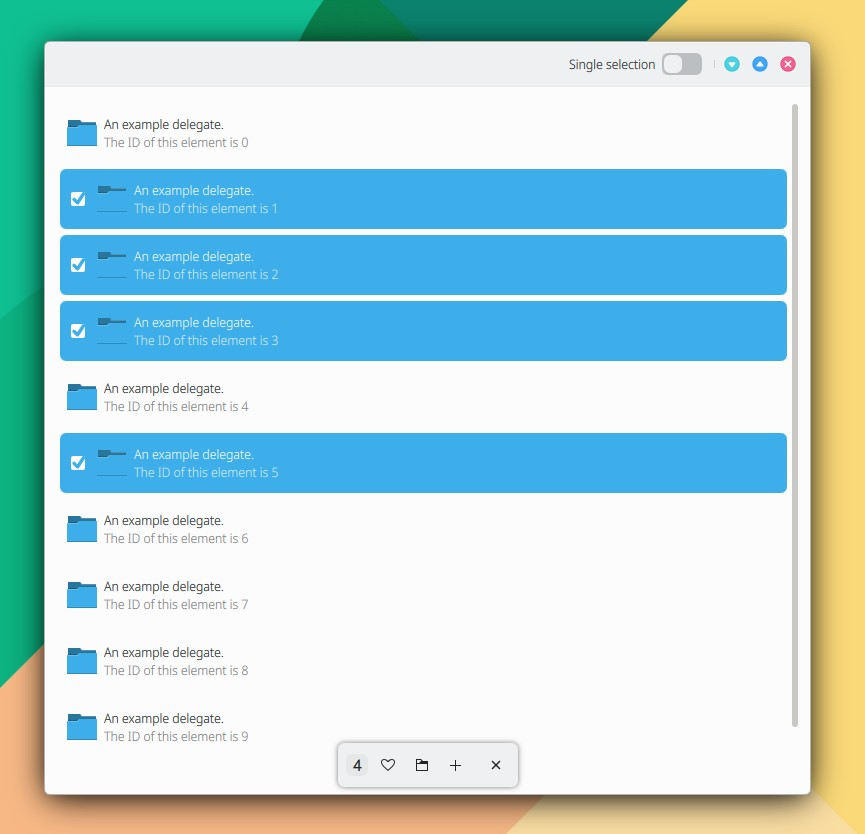

# SelectionBar

```
import QtQuick 2.15
import QtQuick.Controls 2.15
import org.mauikit.controls 1.3 as Maui

Maui.ApplicationWindow
{
    id: root

    Maui.Page
    {
        anchors.fill: parent

        showCSDControls: true
        floatingFooter: true
        flickable: listBrowser.flickable //helps to keep the content from under the selection bar at the end.

        Component.onCompleted: {
            listBrowser.currentIndex = -1
        }

        headBar.rightContent: Switch
        {
            text: "Single selection"
            checked: selectionBar.singleSelection
            onToggled: selectionBar.singleSelection = !selectionBar.singleSelection
        }

        Maui.ListBrowser
        {
            id: listBrowser

            anchors.fill: parent
            anchors.margins: 10

            horizontalScrollBarPolicy: ScrollBar.AsNeeded
            verticalScrollBarPolicy: ScrollBar.AsNeeded

            model: 10

            delegate: Maui.ListBrowserDelegate
            {
                id: list

                property string id : index // we need an unique ID for the selectio nbar

                width: ListView.view.width
                height: 60

                label1.text: "An example delegate."
                label2.text: "The ID of this element is " + id

                iconSource: "folder"

                checkable: false

                Connections
                {
                    target: selectionBar
                    function onUriRemoved(uri) //watch when a uri is removed from the selection bar
                    {
                        if(uri == list.id)
                        {
                            list.checked = false
                        }
                    }

                    function onUriAdded(uri) //watch when an uri is successfully added and mark the delegate as checked
                    {
                        if(uri == list.id)
                        {
                            list.checked = true
                        }
                    }

                    function onCleared() //watch when the selection has been cleared and uncheck all the delegates
                    {
                        list.checked = false
                    }
                }

                onClicked: {
                    list.checked = list.checked ? false: true
                    list.checked ? selectionBar.append(list.id, ({'title': "Testing"})) : selectionBar.removeAtUri(list.id)
                }
            }
        }

        footer: Maui.SelectionBar
        {
            id: selectionBar

            anchors.horizontalCenter: parent.horizontalCenter
            width: Math.min(parent.width-(Maui.Style.space.medium*2), implicitWidth)
            maxListHeight: root.height - (Maui.Style.contentMargins*2)

            Action
            {
                icon.name: "love"
                onTriggered: console.log(selectionBar.getSelectedUrisString())
            }

            Action
            {
                icon.name: "folder"
                onTriggered: console.log(selectionBar.contains("0"))
            }

            Action
            {
                icon.name: "list-add"
            }

            onExitClicked: clear()
        }
    }
}

```

<figure><figcaption></figcaption></figure>

## Propiedades


