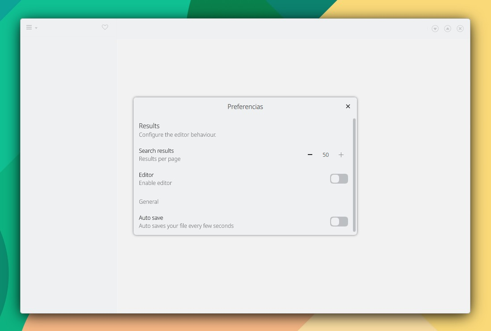

# SettingsDialog

#### 1. Añade el archivo SettingsDialog.qml desde KDevelop > File > New:

```
// SettingsDialog.qml

import QtQuick 2.15
import QtQuick.Controls 2.15
import org.mauikit.controls 1.3 as Maui

Maui.SettingsDialog
{
    Maui.SectionGroup
    {
        title: i18n("Results")
        description: i18n("Configure the editor behaviour.")

        Maui.SectionItem
        {
            label1.text:  i18n("Search results")
            label2.text: i18n("Results per page")
            SpinBox {
                from: 5
                to: 50
                value: maxResults

                onValueModified: {
                    maxResults = value
                }
            }
        }

        Maui.SectionItem
        {
            label1.text:  i18n("Editor")
            label2.text: i18n("Enable editor")
            Switch {
            }
        }
    }

    Maui.SectionGroup
    {
        title: i18n("")
        description: i18n("General")

        Maui.SectionItem
        {
            label1.text:  i18n("Auto save")
            label2.text: i18n("Auto saves your file every few seconds")
            Switch {
            }
        }
    }
}
```

#### 2. Añade SettingsDialog.qml al fichero qml.qrc:

```
<RCC>
    <qresource prefix="/">
        <file>main.qml</file>
        <file>SettingsDialog.qml</file>
    </qresource>
</RCC>
```


#### 3. Añade a main.qml:

```
import Qt.labs.settings 1.0

// En Maui.ApplicationWindow

property int maxResults: 50

Settings {
    property alias maxResults: root.maxResults
}

SettingsDialog
{
    id: settingsDialog
}

// En headBar.leftContent: Maui.ToolButtonMenu

MenuItem
{
    text: i18n("Settings")
    icon.name: "settings-configure"
    onTriggered: {
        settingsDialog.open()
    }
}
```


La configuración es almacenada en el archivo:

```
/home/user/.config/KDE/tuapp.conf
```

<figure><figcaption></figcaption></figure>

## Propiedades


