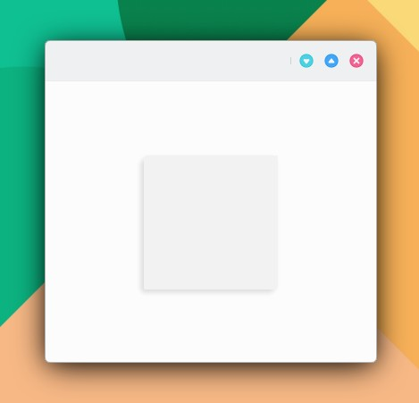

# ShadowedRectangle

```
import QtQuick 2.15
import QtQuick.Controls 2.15
import org.mauikit.controls 1.3 as Maui

Maui.ApplicationWindow
{
    id: root

    Maui.Page {
        anchors.fill: parent

        showCSDControls: true

        Maui.ShadowedRectangle {
            anchors.centerIn: parent

            width: 150
            height: 150

            color: Maui.Theme.alternateBackgroundColor
            border.color: Maui.Theme.alternateBackgroundColor
            border.width: 0
            shadow.size: 10
            shadow.color: Maui.ColorUtils.brightnessForColor(Maui.Theme.backgroundColor) == Maui.ColorUtils.Light ? "#dadada" : "#2c2c2c"
            shadow.xOffset: -3
            shadow.yOffset: 3
            radius: 5
            corners.bottomLeftRadius: 1
            corners.topRightRadius: 1
        }
    }
}

```

```
corners.topLeftRadius
corners.topRightRadius
corners.bottomLeftRadius
corners.bottomRightRadius
renderType: Auto, HighQuality, LowQuality, Software
```

<figure><figcaption></figcaption></figure>

## Propiedades


