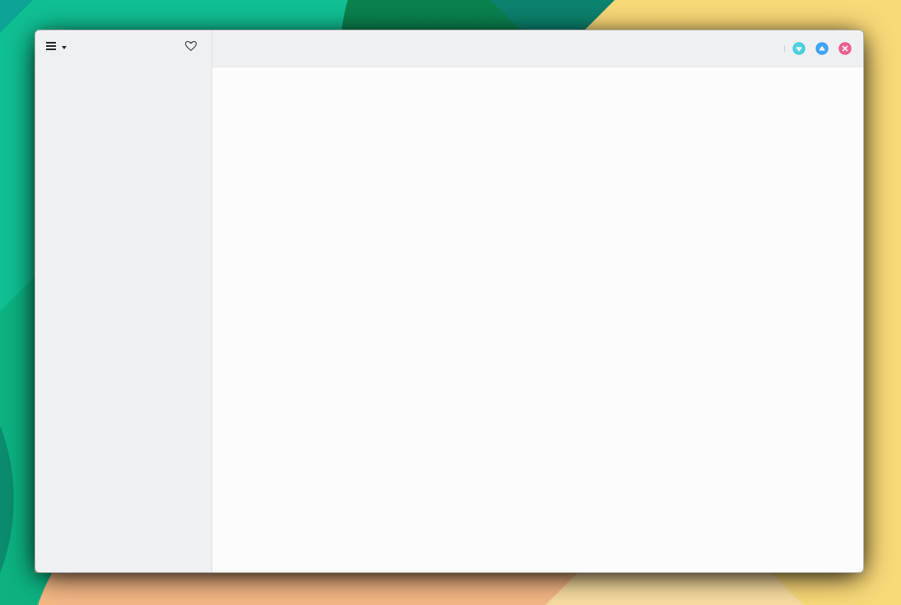

# SideBarView

```
import QtQuick 2.15
import QtQuick.Controls 2.15
import org.mauikit.controls 1.3 as Maui

Maui.ApplicationWindow
{
    id: root
    
    Maui.SideBarView
    {
        anchors.fill: parent
        
        sideBarContent: Maui.Page
        {
            Maui.Theme.colorSet: Maui.Theme.Window
            anchors.fill: parent
            
            headBar.leftContent: Maui.ToolButtonMenu
            {
                icon.name: "application-menu"
                MenuItem
                {
                    text: "About"
                    icon.name: "info-dialog"
                    onTriggered: root.about()
                }
            }
            
            headBar.rightContent: ToolButton
            {
                icon.name: "love"
            }
        }
        
        Maui.Page
        {
            anchors.fill: parent
            showCSDControls: true
        }
    }
}

```

<figure><figcaption></figcaption></figure>

## Propiedades


