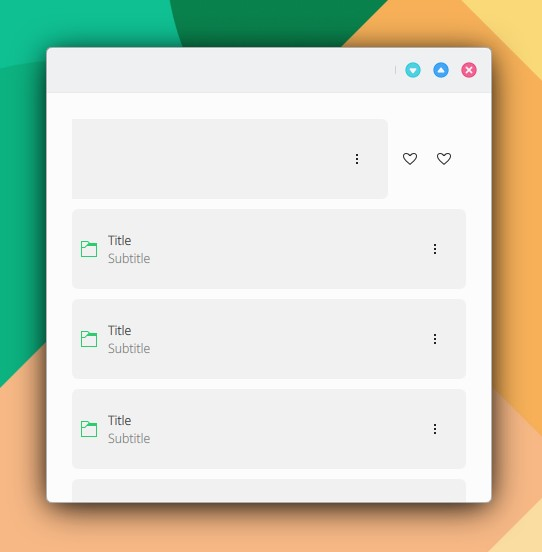

# SwipeBrowserDelegate

```
import QtQuick 2.15
import QtQuick.Controls 2.15
import org.mauikit.controls 1.3 as Maui

Maui.ApplicationWindow
{
    id: root

    Maui.Page {
        anchors.fill: parent

        showCSDControls: true

        Maui.ListBrowser {
            anchors.fill: parent
            anchors.margins: 20

            horizontalScrollBarPolicy: ScrollBar.AlwaysOff
            verticalScrollBarPolicy: ScrollBar.AlwaysOff

            spacing: 10

            model: 10

            delegate: Rectangle {
                color: "transparent"
                width: ListView.view.width
                height: 80
                Maui.SwipeBrowserDelegate
                {
                    anchors.fill: parent
                    label1.text: "Title"
                    label2.text: "Subtitle"
                    iconSource: "folder-green"
                    iconSizeHint: Maui.Style.iconSizes.medium

                    quickActions: [
                        Action
                        {
                            icon.name: "love"
                        },

                        Action
                        {
                            icon.name: "love"
                        }
                    ]
                }
            }
        }
    }
}

```

<figure><figcaption></figcaption></figure>

<figure><figcaption></figcaption></figure>

{% embed url="https://files.gitbook.com/v0/b/gitbook-x-prod.appspot.com/o/spaces%2FED1v8xhNFPWKlgOCuryr%2Fuploads%2Fh0eCSo70bzFAZyslOrZv%2FControls-SwipeBrowserDelegate.mp4?alt=media&token=f89a1fc9-73cc-460a-80b2-573f035d50e7" %}

## Propiedades


