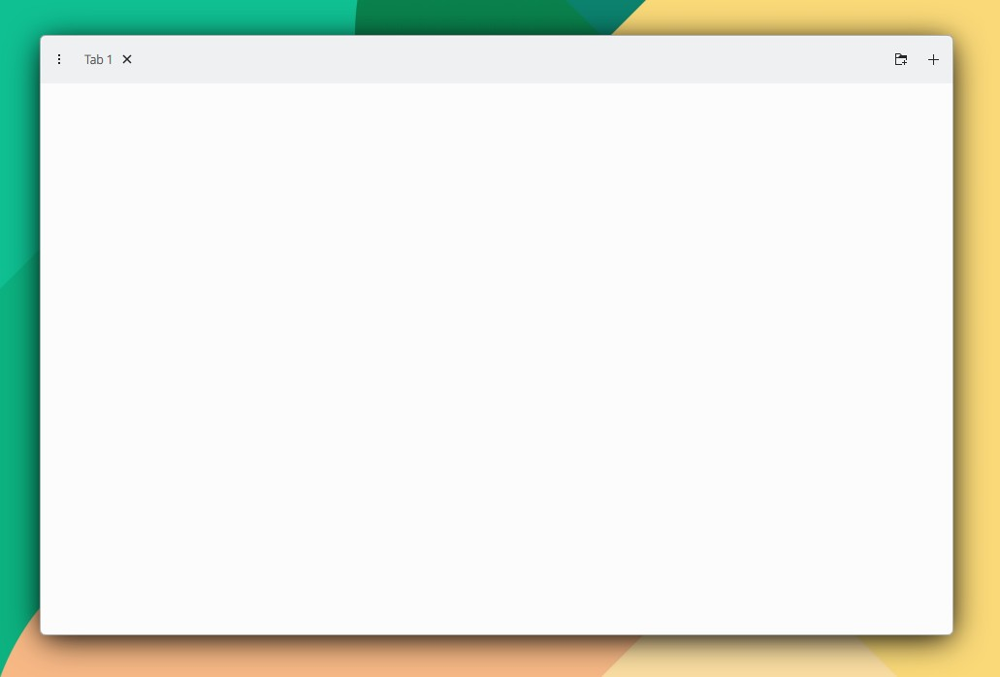

# TabBar

```
import QtQuick 2.15
import QtQuick.Controls 2.15
import org.mauikit.controls 1.3 as Maui

Maui.ApplicationWindow
{
    id: root

    Maui.Page {
        anchors.fill: parent

        headBar.visible: false

        Maui.TabBar
        {
            width: parent.width
            height: 50

            leftContent: ToolButton
            {
                icon.name: "overflow-menu"
            }

            rightContent: ToolButton
            {
                icon.name: "folder-new"
            }

            Maui.TabButton
            {
                text: i18n("Tab 1")
                width: implicitWidth
            }
        }
    }
}
```

<figure><figcaption></figcaption></figure>

## Propiedades


