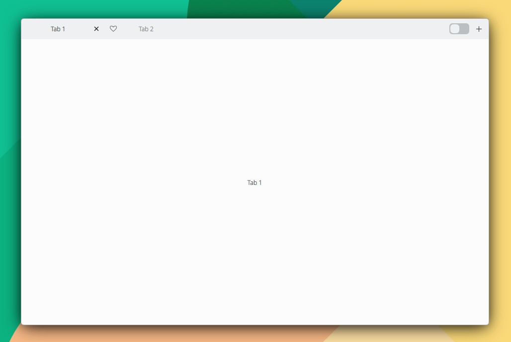
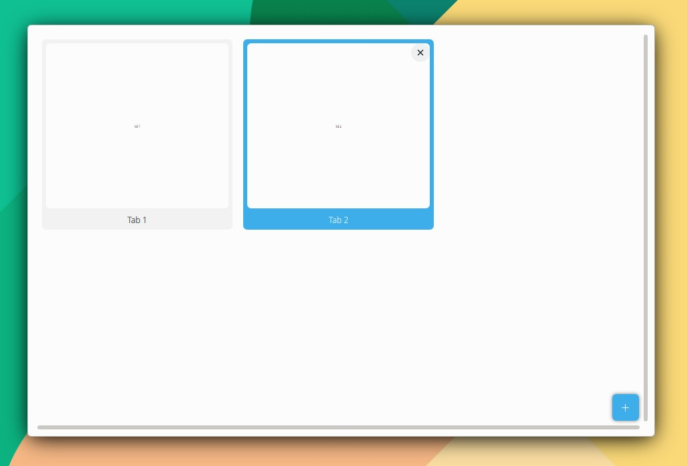

# TabView

```
import QtQuick 2.15
import QtQuick.Controls 2.15
import org.mauikit.controls 1.3 as Maui

Maui.ApplicationWindow
{
    id: root

    Maui.TabView
    {
        anchors.fill: parent

        tabBar.rightContent : Switch
        {
        }

        Rectangle
        {
            Maui.TabViewInfo.tabTitle: "Tab 1"
            color: Maui.Theme.backgroundColor
            Label {
                anchors.centerIn: parent
                text: "Tab 1"
            }
        }

        Rectangle
        {
            Maui.TabViewInfo.tabTitle: "Tab 2"
            Maui.TabViewInfo.tabIcon: "love"
            color: Maui.Theme.backgroundColor
            Label {
                anchors.centerIn: parent
                text: "Tab 2"
            }
        }
    }
}
```

<figure><figcaption></figcaption></figure>

<figure><figcaption></figcaption></figure>
