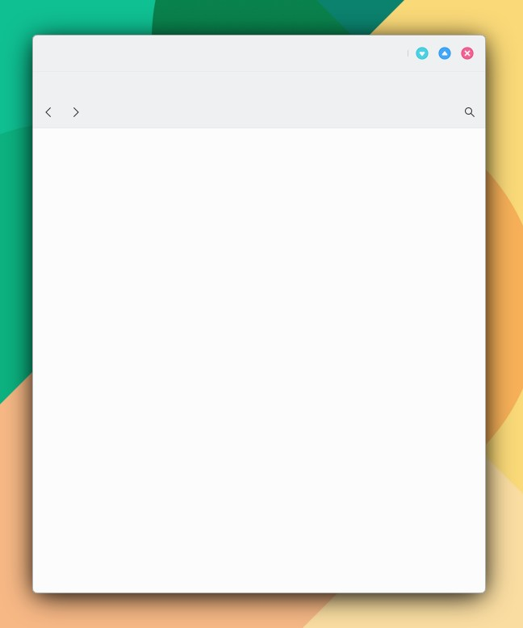

# ToolBar

```
import QtQuick 2.15
import QtQuick.Controls 2.15
import org.mauikit.controls 1.3 as Maui

Maui.ApplicationWindow
{
    id: root

    Maui.Page {
        anchors.fill: parent

        showCSDControls: true

        Maui.ToolBar
        {
            width: parent.width
            height: 70

            position: ToolBar.Header

            leftContent: [
                ToolButton
                {
                    icon.name: "draw-arrow-back"
                },

                ToolButton
                {
                    icon.name: "draw-arrow-forward"
                }
            ]

            rightContent: [
                ToolButton
                {
                    icon.name: "search"
                }
            ]
        }
    }
}

```

<figure><figcaption></figcaption></figure>
