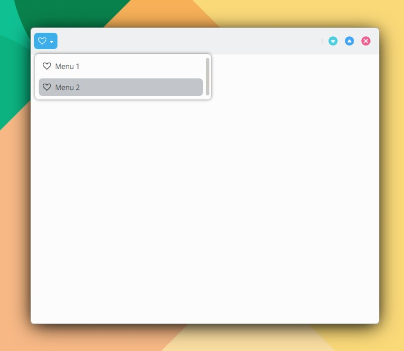

# ToolButtonMenu

```
import QtQuick 2.15
import QtQuick.Controls 2.15
import org.mauikit.controls 1.3 as Maui

Maui.ApplicationWindow
{
    id: root

    Maui.Page {
        anchors.fill: parent

        showCSDControls: true

        headBar.leftContent: Maui.ToolButtonMenu
        {
            anchors.centerIn: parent
            icon.name: "love"

            MenuItem
            {
                icon.name: "love"
                text: "Menu 1"
            }

            MenuItem
            {
                icon.name: "love"
                text: "Menu 2"
            }
        }
    }
}

```

<figure><figcaption></figcaption></figure>

## Propiedades

[https://api.kde.org/mauikit/mauikit/html/classToolButtonMenu.html](https://api.kde.org/mauikit/mauikit/html/classToolButtonMenu.html)
