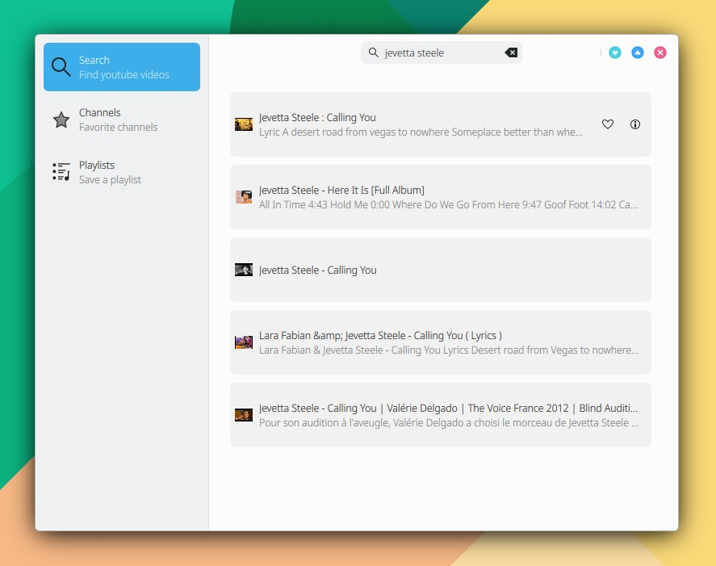

# Añada contenido online a su aplicación

La API REST es un servicio web ofrecido por sitios online, como por ejemplo RadioBrowser, YouTube, Unsplash y numerosos otros. Por lo general regresan la información en formato JSON, aunque también pueden regresar archivos XML o csv.

## RadioBrowser

En este ejemplo se realiza búsqueda de radios en RadioBrowser, mostrando el contenido en la aplicación.

Ejemplo de búsqueda de término "brava" (abrir en Firefox):

```
https://nl1.api.radio-browser.info/json/stations/search?limit=999&name=brava&hidebroken=true&order=clickcount&reverse=true
```

Formato de respuesta JSON:

```
0:
    changeuuid: "be0ac639-9f24-413d-88e6-55c49468ae7c"
    stationuuid: "a4d441bf-b23d-40b2-b2cd-bb8022e6b033"
    serveruuid: "null"
    name: "Brava Radio 103.8 FM Jakarta"
    url: "http://stream.radiojar.com/5k7t0rq3bnzuv"
    url_resolved: "http://n07.radiojar.com/5k7t0rq3bnzuv?rj-ttl=5&rj-tok=AAABjFrGaFUAbQLObJQfi4s_eg"
    homepage: "https://bravaradio.com/"
    favicon: "https://bravaradio.com/favicon.ico"
    ...
1:
    changeuuid: "cbd66e0e-9275-45b5-bf30-0b184ca6ed8b"
    stationuuid: "8d7c5c53-26b4-4770-b3a7-77d2677567e2"
    serveruuid: "null"
    name: "Ke Brava"
    url: "https://stream.zenolive.com/59947b1wfuquv"
    url_resolved: "https://stream-160.zeno.fm/59947b1wfuquv?zs=uu-F3E8-R1WQS2gf2sNutw"
    homepage: "https://kebrava.blogspot.com/"
    favicon: "https://kebrava.blogspot.com/"
    ...
```

Una vez obtenido el objeto se accederá:

```
obj[i].changeuuid
obj[i].stationuuid
obj[i].serveruuid
obj[i].name
obj[i].url
obj[i].url_resolved
obj[i].homepage
obj[i].favicon
```

```
stationsModel.append({"name": obj[i].name,"url": obj[i].url})
```

Añade el siguiente código a una nueva aplicación MauiKit creada con el asistente de KDevelop.

**1. Añade a main.qml:**

```
// main.qml

import QtQuick 2.15
import QtQuick.Controls 2.15
import org.mauikit.controls 1.3 as Maui

Maui.ApplicationWindow
{
    id: root

    ListModel { id: stationsModel }

    Maui.SideBarView
    {
        anchors.fill: parent

        sideBarContent: Maui.Page
        {
            Maui.Theme.colorSet: Maui.Theme.Window
            anchors.fill: parent

            headBar.visible: false

            ListModel {
            id: mainMenuModel
                ListElement { name: "Search" ; description: "Find a radio station" ; icon: "search" }
                ListElement { name: "Genre" ; description: "Music category" ; icon: "view-media-genre" }
                ListElement { name: "Language" ; description: "Search for a station in any language" ; icon: "languages" }
            }

            Maui.ListBrowser {
                id: menuSideBar

                anchors.fill: parent
                anchors.margins: 5

                horizontalScrollBarPolicy: ScrollBar.AlwaysOff
                verticalScrollBarPolicy: ScrollBar.AlwaysOff

                currentIndex: 0

                spacing: 5

                model: mainMenuModel

                delegate: Maui.ListBrowserDelegate {
                    width: ListView.view.width
                    height: 60
                    label1.text: name
                    label2.text: description

                    iconSource: icon

                    onClicked: {
                        switch (index) {
                            case 0: {
                                menuSideBar.currentIndex = index
                                stackView.push("qrc:/Search.qml")
                                return
                            }
                            case 1: {
                                menuSideBar.currentIndex = index
                                //stackView.push("qrc:/Page2.qml")
                                return
                            }
                            case 2: {
                                menuSideBar.currentIndex = index
                                //stackView.push("qrc:/Page3.qml")
                                return
                            }
                        }
                    }
                }
            }
        }

        Maui.Page
        {
            anchors.fill: parent

            headBar.visible: false

            Component.onCompleted: {
                stackView.push("qrc:/Search.qml")
            }

            StackView {
                id: stackView
                anchors.fill: parent
            }
        }
    }
}
```

**2. Añade una nueva paǵina (KDevelop  > File > New) llamada Search.qml:**

```
// Search.qml

import QtQuick 2.15
import QtQuick.Controls 2.15
import org.mauikit.controls 1.3 as Maui

Maui.Page {
    id: searchPage

    showCSDControls: true

    headBar.background: Rectangle {
        anchors.fill: parent
        Maui.Theme.inherit: false
        Maui.Theme.colorSet: Maui.Theme.View
        color: Maui.Theme.backgroundColor
    }

    headBar.middleContent: Maui.SearchField {
        anchors.horizontalCenter: parent.horizontalCenter
        onAccepted: {
            stationsModel.clear()
            search(text)
        }
    }

    function search(query) {

        // RADIO BROWSER

        var xhr = new XMLHttpRequest();
        xhr.onreadystatechange = function() {
            if (xhr.readyState === XMLHttpRequest.HEADERS_RECEIVED) {
                print('HEADERS_RECEIVED')
            } else if(xhr.readyState === XMLHttpRequest.DONE) {
                print('DONE');
                var obj = JSON.parse(xhr.responseText.toString());

                for(var i=0; i<obj.length; i++) {
                    stationsModel.append({"changeuuid": obj[i].changeuuid,"stationuuid": obj[i].stationuuid, "serveruuid": obj[i].serveruuid,"name": obj[i].name,"url": obj[i].url,"url_resolved": obj[i].url_resolved,"homepage": obj[i].homepage,"favicon": obj[i].favicon,"tags": obj[i].tags,"country": obj[i].country, "countrycode": obj[i].countrycode, "iso_3166_2": obj[i].iso_3166_2,"state": obj[i].state, "language": obj[i].language, "languagecodes": obj[i].languagecodecs, "votes": obj[i].votes,"lastchangetime": obj[i].lastchangetime,"lastchangetime_iso8601": obj[i].lastchangetime_iso8601,"codec": obj[i].codec,"bitrate": obj[i].bitrate,"hls": obj[i].hls,"lastcheckok": obj[i].lastcheckok,"lastchecktime": obj[i].lastchecktime,"lastchecktime_iso8601": obj[i].lastchecktime_iso8601,"lastcheckoktime": obj[i].lastcheckoktime,"lastcheckoktime_iso8601": obj[i].lastcheckoktime_iso8601,"lastlocalchecktime": obj[i].lastlocalchecktime,"lastlocalchecktime_iso8601": obj[i].lastlocalchecktime_iso8601,"clicktimestamp": obj[i].clicktimestamp,"clicktimestamp_iso8601": obj[i].clicktimestamp_iso8601,"clickcount": obj[i].clickcount,"clicktrend": obj[i].clicktrend,"ssl_error": obj[i].ssl_error,"geo_lat	null": obj[i].geo_latnull,"geo_long": obj[i].geo_long, "has_extended_info": obj[i].has_extended_info})
                }
            }
        }
        xhr.open("GET", "https://nl1.api.radio-browser.info/json/stations/search?limit=999&name=" + query + "&hidebroken=true&order=clickcount&reverse=true");
        xhr.send();
    }

    Maui.ListBrowser {
        anchors.fill: parent
        anchors.margins: 20

        horizontalScrollBarPolicy: ScrollBar.AsNeeded
        verticalScrollBarPolicy: ScrollBar.AsNeeded

        spacing: 10

        model: stationsModel

        delegate: Rectangle {
            color: "transparent"
            width: ListView.view.width
            height: 80
            Maui.SwipeBrowserDelegate
            {
                anchors.fill: parent
                label1.text: name
                label2.text: tags
                iconSource: favicon
                iconSizeHint: Maui.Style.iconSizes.medium

                quickActions: [
                    Action
                    {
                        icon.name: "love"
                    },

                    Action
                    {
                        icon.name: "documentinfo"
                    }
                ]
            }
        }
    }
}
```

**3. Añade Search.qml al archivo de recursos qml.qrc:**

```
<RCC>
    <qresource prefix="/">
        <file>main.qml</file>
        <file>Search.qml</file>
    </qresource>
</RCC>
```

<figure><figcaption></figcaption></figure>

#### Solicitudes API

<pre><code><strong>// Búsqueda
</strong>https://at1.api.radio-browser.info/json/stations/search?limit=10&#x26;name=brava&#x26;hidebroken=true&#x26;order=clickcount&#x26;reverse=true
<strong>
</strong>// Estaciones por país:
https://at1.api.radio-browser.info/json/stations/search?limit=10&#x26;countrycode=US&#x26;hidebroken=true&#x26;order=clickcount&#x26;reverse=true

// Estaciones por idioma:
https://at1.api.radio-browser.info/json/stations/search?limit=10&#x26;language=spanish&#x26;hidebroken=true&#x26;order=clickcount&#x26;reverse=true

// Estaciones por tag:
https://at1.api.radio-browser.info/json/stations/search?limit=10&#x26;tagList=pop&#x26;hidebroken=true&#x26;order=clickcount&#x26;reverse=true
</code></pre>

## YouTube

Para acceder a YouTube es necesario registrar una clave API. Siga estos sencillos pasos para obtenerla:



Ejemplo de búsqueda de término "madrid" (abrir en Firefox). Es necesario añadir al final la clave API:

```
https://www.googleapis.com/youtube/v3/search?part=snippet&q=madrid&key=
```

Formato de respuesta JSON:

```
kind: "youtube#searchListResponse"
etag: "1FYjzINNJH9GjlwtsKREdJjDKaM"
nextPageToken: "CAUQAA"
regionCode: "ES"
pageInfo:
    totalResults: 1000000
    resultsPerPage: 5
items:
    [0]
        kind: "youtube#searchResult"
        etag: "gNbO2BDX38K5ztPi6vd5Oas2itQ"
        id:
            kind: "youtube#video"
            videoId: "ka5VtsbGl8E"
        snippet:
            publishedAt: "2023-12-09T22:20:09Z"
            channelId: "UCWV3obpZVGgJ3j9FVhEjF2Q"
            title: "Real Betis 1-1 Real Madrid | HIGHLIGHTS | LaLiga 2023/24"
            description: "Real Madrid drew at the Benito Villamarín on LaLiga matchday 16. Ancelotti's side took the lead through Bellingham, who has ..."
            thumbnails:
                default:
                    url: "https://i.ytimg.com/vi/ka5VtsbGl8E/default.jpg"
                    width: 120
                    ...
            publishTime: "2023-12-09T22:20:09Z" 
    [1]
        kind: "youtube#searchResult"
        etag: "yQ8FFqjetMcHVlSnYEyCQljo8co"
        id:
            kind: "youtube#video"
            videoId: "AfvnWbtRPiE"
        snippet: {
            publishedAt: "2023-12-01T05:00:07Z"
            channelId: "UCTeE0q8xCsbCBL4npUWDPFg"
            title: "Juhn - Madrid [Video Oficial]"
            description: "Juhn \"Madrid\", performing video (c) 2023 JSG Records (Juhn Music, S by Santana and Ganda LLC) Dale PLAY en todas las ..."
            thumbnails:
                default:
                url: "https://i.ytimg.com/vi/AfvnWbtRPiE/default.jpg"
                width: 120
                ...
            publishTime: "2023-12-01T05:00:07Z"
    [2]
    ...
```

Una vez obtenido el objeto se accederá:

```
obj.nextPageToken
obj.items[i].id.videoId
obj.items[i].snippet.title
obj.items[i].snippet.description
obj.items[i].snippet.thumbnails.default.url
```

```
videoModel.append({"videoId": obj.items[i].id.videoId,"title": obj.items[i].snippet.title})
```

Añade el siguiente código a una nueva aplicación MauiKit:

**1. Añade a main.qml** (incluya una clave API en apiKeyYouTube)**:**

```
property string apiKeyYouTube: ""
```

```
// main.qml

import QtQuick 2.15
import QtQuick.Controls 2.15
import org.mauikit.controls 1.3 as Maui

Maui.ApplicationWindow
{
    id: root

    property string apiKeyYouTube: ""

    ListModel { id: videoModel }

    Maui.SideBarView
    {
        anchors.fill: parent

        sideBarContent: Maui.Page
        {
            Maui.Theme.colorSet: Maui.Theme.Window
            anchors.fill: parent

            headBar.visible: false

            ListModel {
            id: mainMenuModel
                ListElement { name: "Search" ; description: "Find youtube videos" ; icon: "search" }
                ListElement { name: "Channels" ; description: "Favorite channels" ; icon: "view-media-favorite" }
                ListElement { name: "Playlists" ; description: "Save a playlist" ; icon: "view-media-playlist" }
            }

            Maui.ListBrowser {
                id: menuSideBar

                anchors.fill: parent
                anchors.margins: 5

                horizontalScrollBarPolicy: ScrollBar.AlwaysOff
                verticalScrollBarPolicy: ScrollBar.AlwaysOff

                currentIndex: 0

                spacing: 5

                model: mainMenuModel

                delegate: Maui.ListBrowserDelegate {
                    width: ListView.view.width
                    height: 60
                    label1.text: name
                    label2.text: description

                    iconSource: icon

                    onClicked: {
                        switch (index) {
                            case 0: {
                                menuSideBar.currentIndex = index
                                stackView.push("qrc:/Search.qml")
                                return
                            }
                            case 1: {
                                menuSideBar.currentIndex = index
                                //stackView.push("qrc:/Page2.qml")
                                return
                            }
                            case 2: {
                                menuSideBar.currentIndex = index
                                //stackView.push("qrc:/Page3.qml")
                                return
                            }
                        }
                    }
                }
            }
        }

        Maui.Page
        {
            anchors.fill: parent

            headBar.visible: false

            Component.onCompleted: {
                stackView.push("qrc:/Search.qml")
            }

            StackView {
                id: stackView
                anchors.fill: parent
            }
        }
    }
}
```

**2. Añade una nueva paǵina (KDevelop  > File > New) llamada Search.qml:**

```
import QtQuick 2.15
import QtQuick.Controls 2.15
import org.mauikit.controls 1.3 as Maui

Maui.Page {
    id: searchPage

    showCSDControls: true

    headBar.background: Rectangle {
        anchors.fill: parent
        Maui.Theme.inherit: false
        Maui.Theme.colorSet: Maui.Theme.View
        color: Maui.Theme.backgroundColor
    }

    headBar.middleContent: Maui.SearchField {
        anchors.horizontalCenter: parent.horizontalCenter
        onAccepted: {
            videoModel.clear()
            search(text)
        }
    }

    function search(query) {
        var xhr = new XMLHttpRequest();
        xhr.onreadystatechange = function() {
            if (xhr.readyState === XMLHttpRequest.HEADERS_RECEIVED) {
                print('HEADERS_RECEIVED')
            } else if(xhr.readyState === XMLHttpRequest.DONE) {
                print('DONE');
                var obj = JSON.parse(xhr.responseText.toString());

                for(var i=0; i<obj.items.length; i++) {
                    videoModel.append({"videoId": obj.items[i].id.videoId,"title": obj.items[i].snippet.title,"thumbnailUrl": obj.items[i].snippet.thumbnails.default.url,"description": obj.items[i].snippet.description})
                }
            }
        }
        xhr.open("GET", "https://www.googleapis.com/youtube/v3/search?part=snippet&q=" + query + "&key=" + apiKeyYouTube);
        xhr.send();
    }

    Maui.ListBrowser {
        anchors.fill: parent
        anchors.margins: 20

        horizontalScrollBarPolicy: ScrollBar.AsNeeded
        verticalScrollBarPolicy: ScrollBar.AsNeeded

        spacing: 10

        model: videoModel

        delegate: Rectangle {
            color: "transparent"
            width: ListView.view.width
            height: 80
            Maui.SwipeBrowserDelegate
            {
                anchors.fill: parent
                label1.text: title
                label2.text: description
                iconSource: thumbnailUrl
                iconSizeHint: Maui.Style.iconSizes.medium

                quickActions: [
                    Action
                    {
                        icon.name: "love"
                    },

                    Action
                    {
                        icon.name: "documentinfo"
                    }
                ]
            }
        }
    }
}
```

**3. Añade Search.qml al archivo de recursos qml.qrc:**

```
<RCC>
    <qresource prefix="/">
        <file>main.qml</file>
        <file>Search.qml</file>
    </qresource>
</RCC>
```

<figure><figcaption></figcaption></figure>

#### Solicitudes API

<pre><code>// 1 Búsqueda:

// Primera página:
"https://www.googleapis.com/youtube/v3/search?part=snippet&#x26;q=" + query + "&#x26;maxResults=" + maxResults + "&#x26;key=" + apiKeyYouTube

// Páginas siguientes:
"https://www.googleapis.com/youtube/v3/search?pageToken=" + nextPageToken + "&#x26;part=snippet&#x26;q=" + query + "&#x26;maxResults=" + maxResults + "&#x26;key=" + apiKeyYouTube

// 2 Playlists de un canal:
"https://www.googleapis.com/youtube/v3/playlists?part=snippet&#x26;channelId=" + idChannel + "&#x26;maxResults=" + maxResults + "&#x26;key=" + apiKeyYouTube

// 3 Contenido de una playlist:

// Primera página:
"https://youtube.googleapis.com/youtube/v3/playlistItems?part=snippet&#x26;playlistId=" + playlistId + "&#x26;maxResults=" + maxResults + "&#x26;key=" + apiKeyYouTube

<strong>// Páginas siguientes:
</strong>"https://youtube.googleapis.com/youtube/v3/playlistItems?pageToken=" + nextPageToken + "&#x26;part=snippet&#x26;playlistId=" + playlistId + "&#x26;maxResults=" + maxResults + "&#x26;key=" + apiKeyYouTube

// 4 Contenido de un canal:

// Obtener playlist de subidas (info de canal):
"https://www.googleapis.com/youtube/v3/channels?id=" + channelId + "&#x26;key=" + apiKeyYouTube + "&#x26;part=snippet,contentDetails,statistics"

// Obtener contenido de la playlist de subidas (videos del canal):

// Primera página:
"https://youtube.googleapis.com/youtube/v3/playlistItems?part=snippet&#x26;playlistId=" + uploadsPlaylistId + "&#x26;maxResults=" + maxResults + "&#x26;key=" + apiKeyYouTube

// Páginas siguientes:
"https://youtube.googleapis.com/youtube/v3/playlistItems?pageToken=" + nextPageToken + "&#x26;part=snippet&#x26;playlistId=" + uploadsPlaylistId + "&#x26;maxResults=" + maxResults + "&#x26;key=" + apiKeyYouTube

</code></pre>
