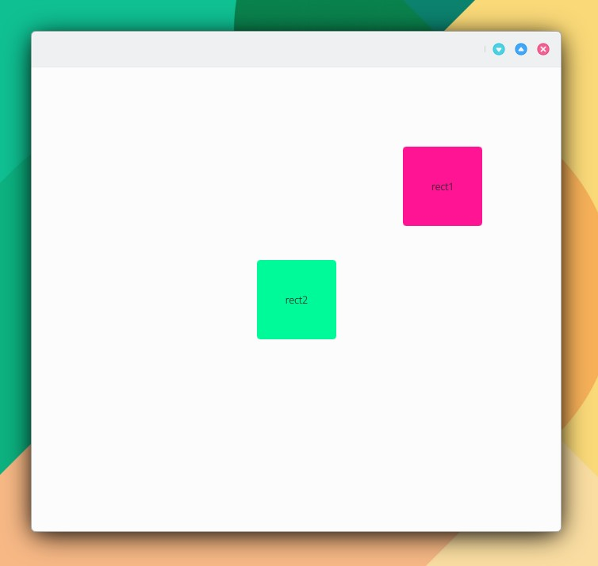
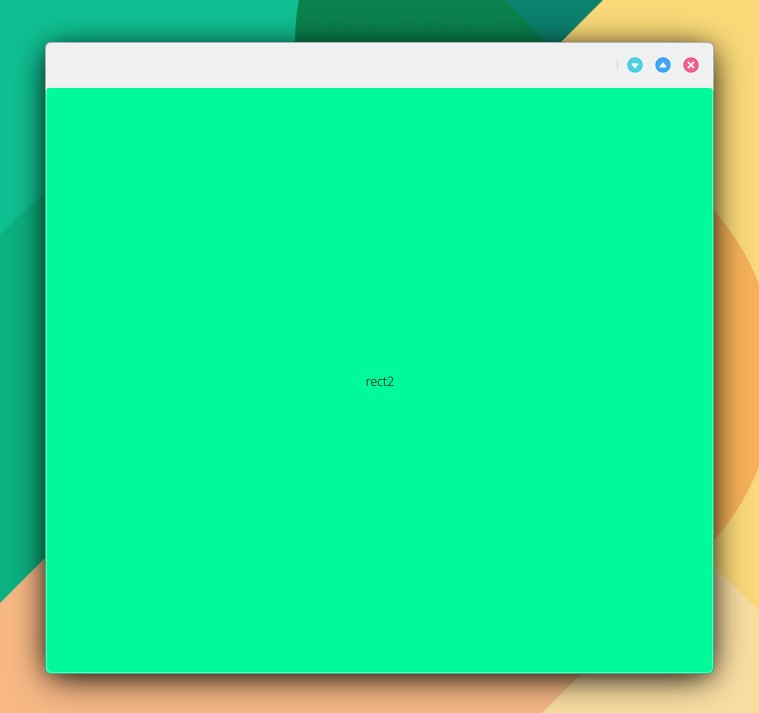
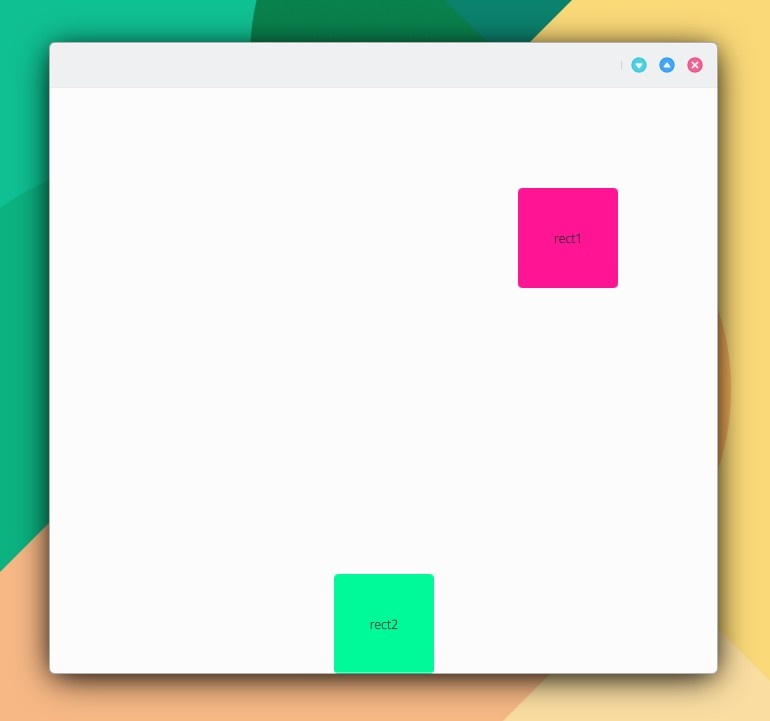
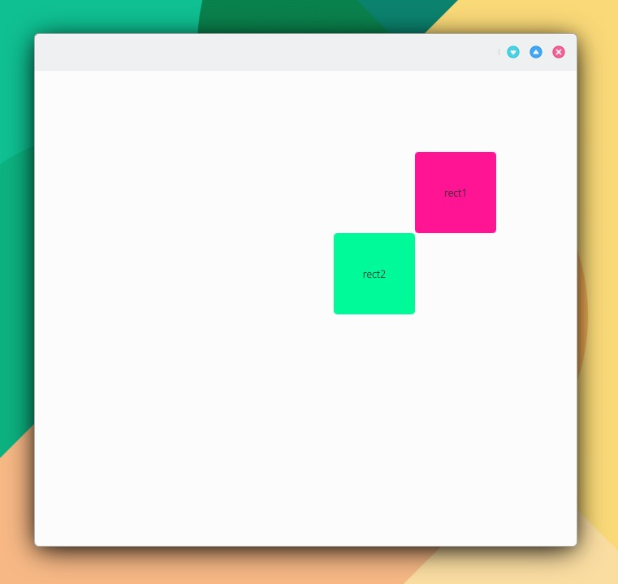
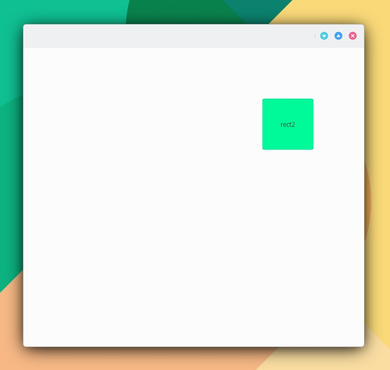
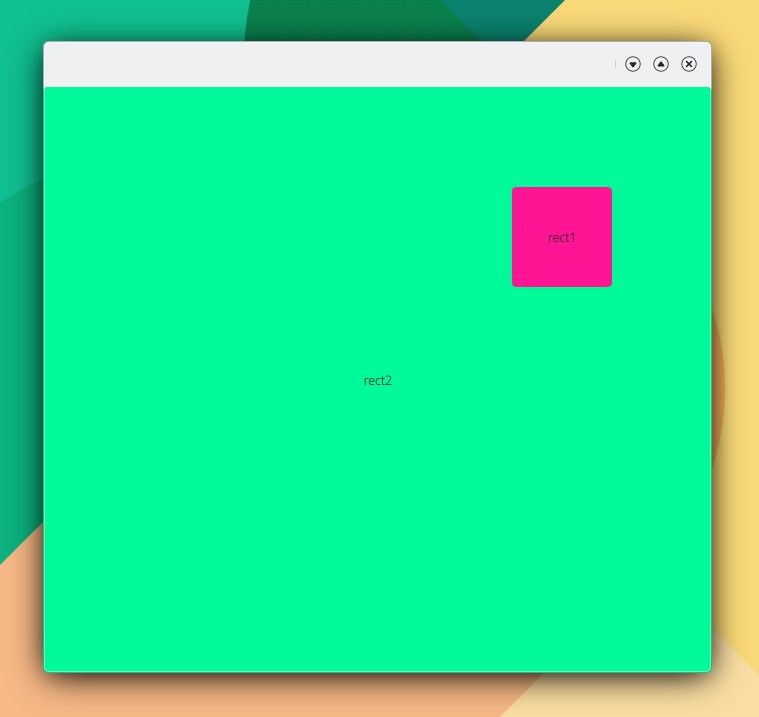

# Anclaje de controles

* anchors.alignWhenCentered
* anchors.baseline
* anchors.baselineOffset
* anchors.bottom
* anchors.bottomMargin
* anchors.centerIn
* anchors.fill
* anchors.horizontalCenter
* anchors.horizontalCenterOffset
* anchors.left
* anchors.leftMargin
* anchors.margins
* anchors.right
* anchors.rightMargin
* anchors.top
* anchors.topMargin
* anchors.verticalCenter
* anchors.verticalCenterOffset

```
import QtQuick 2.15
import QtQuick.Controls 2.15
import org.mauikit.controls 1.3 as Maui

Maui.ApplicationWindow
{
    id: root

    Maui.Page {
        anchors.fill: parent

        showCSDControls: true

        Rectangle {
            id: rect1

            anchors.right: parent.right
            anchors.top: parent.top
            anchors.margins: 100
            width: 100
            height: 100
            color: "deeppink"
            radius: 4

            Label {
                anchors.centerIn: parent
                text: "rect1"
            }
        }

        Rectangle {
            id: rect2

            anchors.centerIn: parent

            width: 100
            height: 100
            color: "mediumspringgreen"
            radius: 4

            Label {
                anchors.centerIn: parent
                text: "rect2"
            }
        }
    }
}
```

## Casos de anclaje de rect2.

**Anclaje 1.**

```
anchors.centerIn: parent
```

<figure><figcaption></figcaption></figure>

**Anclaje 2.**

```
anchors.fill: parent
```

<figure><figcaption></figcaption></figure>

**Anclaje 3.**

```
anchors.bottom: parent.bottom
anchors.horizontalCenter: parent.horizontalCenter
```

<figure><figcaption></figcaption></figure>

**Anclaje 4.**

```
anchors.top: rect1.bottom
anchors.right: rect1.left
```

<figure><figcaption></figcaption></figure>

**Anclaje 5.**

anchors.fill: rect1

<figure><figcaption></figcaption></figure>

## Orden z.

Define la posición por encima o por debajo de un control sobre los demás controles. Para el caso de "Anclaje 2" si se establece "z: 1" en rect1, éste será establecido encima de rect2.

```
import QtQuick 2.15
import QtQuick.Controls 2.15
import org.mauikit.controls 1.3 as Maui

Maui.ApplicationWindow
{
    id: root

    Maui.Page {
        anchors.fill: parent

        showCSDControls: true

        Rectangle {
            id: rect1

            anchors.right: parent.right
            anchors.top: parent.top
            anchors.margins: 100
            width: 100
            height: 100
            color: "deeppink"
            radius: 4
            z: 1

            Label {
                anchors.centerIn: parent
                text: "rect1"
            }
        }

        Rectangle {
            id: rect2

            anchors.fill: parent

            width: 100
            height: 100
            color: "mediumspringgreen"
            radius: 4

            Label {
                anchors.centerIn: parent
                text: "rect2"
            }
        }
    }
}
```

<figure><figcaption></figcaption></figure>
