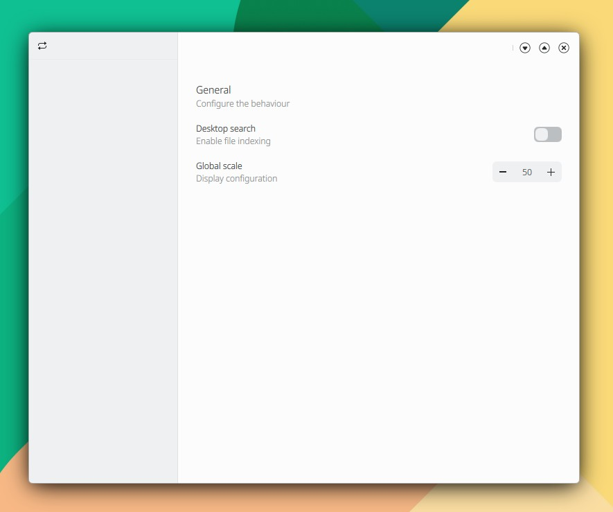

# Animaciones

**Efectuar una animación iniciándola explícitamente con la función start().**

El componente stackView permite cargar diversas páginas qml en el mismo espacio o componente padre:

```
stackView.push("qrc:/Home.qml")
stackView.push("qrc:/Users.qml")
```

Añade main.qml, Home.qml y qml.qrc. El código para efectuar la animación se encuentra en Home.qml.

```
// main.qml

import QtQuick 2.15
import QtQuick.Controls 2.15
import org.mauikit.controls 1.3 as Maui

Maui.ApplicationWindow
{
    id: root
    title: qsTr("")

    width: Screen.desktopAvailableWidth - Screen.desktopAvailableWidth * 45 / 100
    height: Screen.desktopAvailableHeight - Screen.desktopAvailableHeight * 20 / 100

    Component.onCompleted: {
        stackView.push("qrc:/Home.qml")
    }

    Maui.SideBarView
    {
        id: sideBarView
        anchors.fill: parent

        sideBarContent:  Maui.Page
        {
            id: sideBarPage

            anchors.fill: parent
            Maui.Theme.colorSet: Maui.Theme.Window

            headBar.leftContent: ToolButton {
                icon.name: "start-over"
                onClicked: {
                    stackView.push("qrc:/Home.qml")
                }
            }
        }

        Maui.Page
        {
            anchors.fill: parent

            showCSDControls: true
            headBar.background: null

            StackView {
                id: stackView
                anchors.fill: parent
                clip: true
            }
        }
    }
}
```

```
// Home.qml

import QtQuick 2.15
import QtQuick.Controls 2.15
import org.mauikit.controls 1.3 as Maui

Maui.Page
{
    id: page

    headBar.visible: false

    Component.onCompleted: {
        opacityAnimation.start()
        xAnimation.start()
    }

    PropertyAnimation {
        id: opacityAnimation
        target: page
        properties: "opacity"
        from: 0
        to: 1.0
        duration: 250

        // Puedes establecer una curva de animación y modificar la intensidad de actuación:
        // easing.type: Easing.InBack
        // easing.overshoot: 10
    }

    PropertyAnimation {
        id: xAnimation
        target: page
        properties: "x"
        from: -20
        to: 0
        duration: 500

        // easing.type: Easing.InBack
        // easing.overshoot: 10
    }


    Maui.SectionGroup
    {
        anchors.left: parent.left
        anchors.right: parent.right
        anchors.top: parent.top
        anchors.margins: 20
        height: 50 * 3

        title: i18n("General")
        description: i18n("Configure the behaviour")

        Maui.SectionItem
        {
            label1.text:  i18n("Desktop search")
            label2.text: i18n("Enable file indexing")
            Switch {
            }
        }

        Maui.SectionItem
        {
            label1.text:  i18n("Global scale")
            label2.text: i18n("Display configuration")
            SpinBox {
                id: spinBox
                from: 0
                to: 100
                value: 50
            }
        }
    }
}
```

```
// qml.qrc

<RCC>
    <qresource prefix="/">
        <file>main.qml</file>
        <file>Home.qml</file>
    </qresource>
</RCC>
```

<figure><figcaption></figcaption></figure>

{% embed url="https://files.gitbook.com/v0/b/gitbook-x-prod.appspot.com/o/spaces%2FED1v8xhNFPWKlgOCuryr%2Fuploads%2FSXzvkb46qwM12b5VSmwp%2FDoc-Util-Animations.mp4?alt=media&token=c733f152-d9da-4d6a-840b-5fc6202e4057" %}
