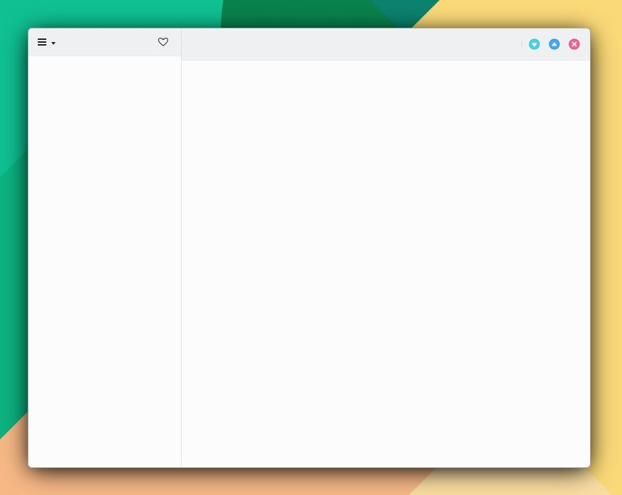
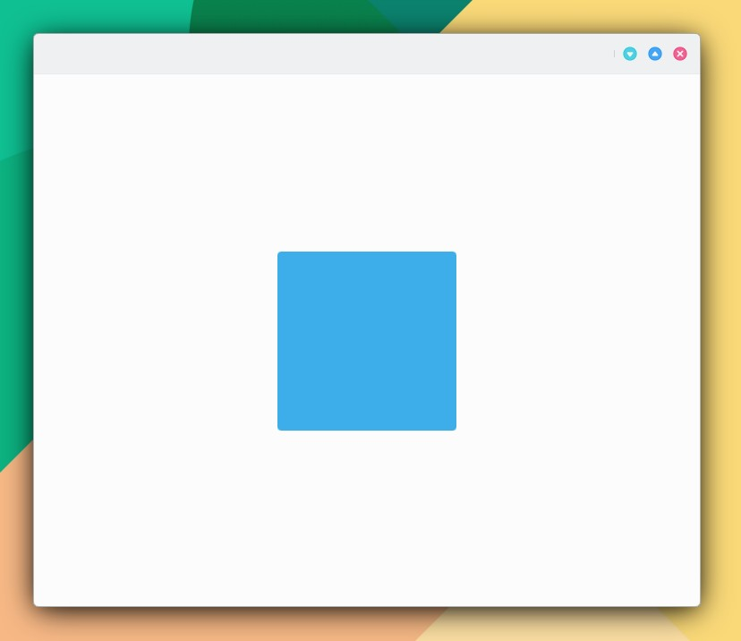

# Colores

## Set de colores

KDE ha establecido sets de esquemas de colores para las diferentes partes de una apicación:&#x20;

* **Maui.Theme.Window**: set de color por defecto para ventanas y áreas de cromo.
* **Maui.Theme.View**: set de color para las vistas de elementos, normalmente el más claro (en temas claros).
* **Maui.Theme.Button**: set de color usado por botones.
* **Maui.Theme.Selection**: set de color usado por áreas seleccionadas.
* **Maui.Theme.Tooltip**: set de color usado por los globos o descripciones emergentes.
* **Maui.Theme.Complementary**: set de color para ser usado como complemento con Window. Normalmente es oscuro incluso en temas claros. Puede ser usado como énfasis en pequeñas áreas de la aplicación.

```
Maui.Theme.colorSet: Maui.Theme.View
```

Al definir un set es heredado por todos los componentes hijo, a menos que se especifique lo contrario mediante:

```
Maui.Theme.inherit: false
```

```
import QtQuick 2.15
import QtQuick.Controls 2.15
import org.mauikit.controls 1.3 as Maui

Maui.ApplicationWindow
{
    id: root

    Maui.SideBarView
    {
        anchors.fill: parent

        sideBarContent: Maui.Page
        {
            // COLOR SET
            Maui.Theme.colorSet: Maui.Theme.View

            anchors.fill: parent

            headBar.leftContent: Maui.ToolButtonMenu
            {
                icon.name: "application-menu"
                MenuItem
                {
                    text: "About"
                    icon.name: "info-dialog"
                    onTriggered: root.about()
                }
            }

            headBar.rightContent: ToolButton
            {
                icon.name: "love"
            }
        }

        Maui.Page
        {
            anchors.fill: parent
            showCSDControls: true
        }
    }
}

```

<figure><figcaption></figcaption></figure>

## Colores del sistema

* Maui.Theme.textColor
* Maui.Theme.disabledTextColor
* Maui.Theme.highlightColor
* Maui.Theme.highlightedTextColor
* Maui.Theme.backgroundColor
* Maui.Theme.alternateBackgroundColor
* Maui.Theme.focusColor
* Maui.Theme.hoverColor
* Maui.Theme.activeTextColor
* Maui.Theme.activeBackgroundColor
* Maui.Theme.linkColor
* Maui.Theme.linkBackgroundColor
* Maui.Theme.visitedLinkColor
* Maui.Theme.visitedLinkBackgroundColor
* Maui.Theme.negativeTextColor
* Maui.Theme.negativeBackgroundColor
* Maui.Theme.neutralTextColor
* Maui.Theme.neutralBackgroundColor
* Maui.Theme.positiveTextColor
* Maui.Theme.positiveBackgroundColor
* Maui.Theme.buttonTextColor
* Maui.Theme.buttonBackgroundColor
* Maui.Theme.buttonAlternateBackgroundColor
* Maui.Theme.buttonHoverColor
* Maui.Theme.buttonFocusColor
* Maui.Theme.viewTextColor
* Maui.Theme.viewBackgroundColor
* Maui.Theme.viewAlternateBackgroundColor
* Maui.Theme.viewHoverColor
* Maui.Theme.viewFocusColor
* Maui.Theme.selectionTextColor
* Maui.Theme.selectionBackgroundColor
* Maui.Theme.selectionAlternateBackgroundColor
* Maui.Theme.selectionHoverColor
* Maui.Theme.selectionFocusColor
* Maui.Theme.tooltipTextColor
* Maui.Theme.tooltipBackgroundColor
* Maui.Theme.tooltipAlternateBackgroundColor
* Maui.Theme.tooltipHoverColor

```
color: "#0FC092"
color: Maui.Theme.focusColor
```

```
import QtQuick 2.15
import QtQuick.Controls 2.15
import org.mauikit.controls 1.3 as Maui

Maui.ApplicationWindow
{
    id: root

    Maui.Page {
        anchors.fill: parent
        showCSDControls: true

        Rectangle {
            anchors.centerIn: parent
            width: 200
            height: 200
            color: Maui.Theme.focusColor
            radius: 4
        }
    }
}
```

<figure><figcaption></figcaption></figure>

## Aclarar u oscurecer un color.

```
color: Qt.lighter(Maui.Theme.backgroundColor, 1.2)
color: Qt.darker(Maui.Theme.backgroundColor, 2)
color: Qt.lighter("#0FC092", 1.5)
color: Qt.lighter("#550FC092", 1.5)    // Color con transparencia alpha 55 hexadecimal
```
