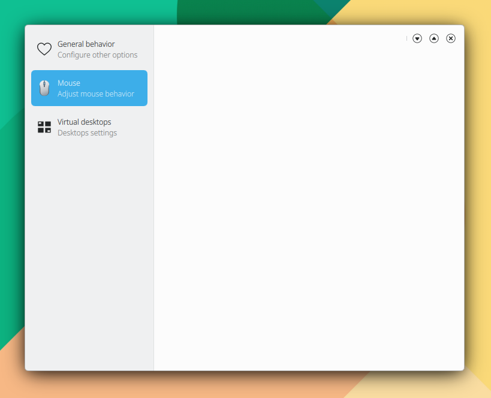

# Componentes modelo-delegado o listas y cuadrículas

* Modelo: son los datos entrantes como nombre de usuario, edad. Es el componente QML ListModel.&#x20;
* Delegado: cómo desea mostrar la información, en una lista, una rejilla o cuadrícula, un rectángulo o cualquier otro componente. Es el componente QML elegido para mostrar los datos.

Se muestran 2 ejemplos:

1. Rellenando el modelo de datos directamente con información definida en el proprio fichero QML.
2. Rellenando el modelo de datos con información procedente de código o funcionalidad C++.

## Ejemplo 1. Rellenando el modelo con datos definidos en el proprio fichero QML. Mostrar un menú para Side Bar.

Añada el siguiente código a **main.qml**:

```
import QtQuick 2.15
import QtQuick.Controls 2.15
import org.mauikit.controls 1.3 as Maui

Maui.ApplicationWindow
{
    id: root

    Maui.SideBarView
    {
        anchors.fill: parent

        sideBarContent: Maui.Page
        {
            Maui.Theme.colorSet: Maui.Theme.Window
            anchors.fill: parent

            headBar.visible: false

            ListModel {
            id: mainMenuModel
                ListElement { name: "General behavior" ; description: "Configure other options" ; icon: "love" }
                ListElement { name: "Mouse" ; description: "Adjust mouse behavior" ; icon: "input-mouse" }
                ListElement { name: "Virtual desktops" ; description: "Desktops settings" ; icon: "virtual-desktops" }
            }

            Maui.ListBrowser {
                id: menuSideBar

                anchors.fill: parent
                anchors.margins: 5

                horizontalScrollBarPolicy: ScrollBar.AlwaysOff
                verticalScrollBarPolicy: ScrollBar.AlwaysOff

                currentIndex: 0

                spacing: 5

                model: mainMenuModel

                delegate: Maui.ListBrowserDelegate {
                    width: ListView.view.width
                    height: 60
                    label1.text: name
                    label2.text: description

                    iconSource: icon

                    onClicked: {
                        switch (index) {
                            case 0: {
                                menuSideBar.currentIndex = index
                                //stackView.push("qrc:/Page1.qml")
                                return
                            }
                            case 1: {
                                menuSideBar.currentIndex = index
                                //stackView.push("qrc:/Page2.qml")
                                return
                            }
                            case 2: {
                                menuSideBar.currentIndex = index
                                //stackView.push("qrc:/Page3.qml")
                                return
                            }
                        }
                    }
                }
            }
        }

        Maui.Page
        {
            anchors.fill: parent
            showCSDControls: true

            headBar.background: null

            StackView {
                id: stackView
            }
        }
    }
}
```

<figure><figcaption></figcaption></figure>

currentIndex le permite establecer como seleccionado el correspondiente elemento al pulsar el mismo, mostrándolo con el color de selección, en este caso azul.

Si no desea seleccionar ningún elemento:

```
currentIndex: -1
```

También puede mostrar múltiples páginas de menú usando un StackView:

```
sideBarContent: Maui.Page
{
    Maui.Theme.colorSet: Maui.Theme.Window
    anchors.fill: parent

    headBar.visible: false

    Component.onCompleted: {
        stackMenu.push("qrc:/Menu1.qml")
    }

    StackView {
        id: stackMenu
    }
}
```

Un código usando StackView se muestra en:


[animaciones.md](animaciones.md)

