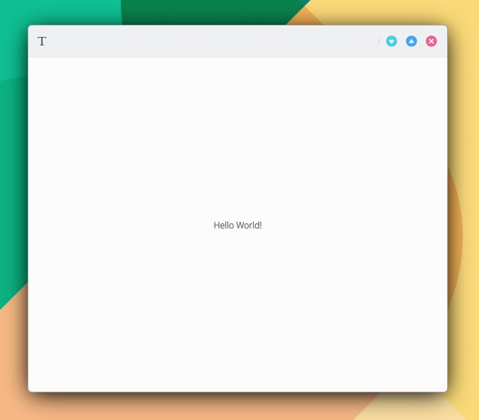

# Conectar funcionalidad C++ con la interfaz QML.

### 1. Añade el siguiente código a un nuevo archivo (KDevelop > File > New) y guardalo en tu aplicación MauiKit en myapp/src/code/backend.h:

```
#pragma once

#include <QObject>
#include <QDebug>

class Backend : public QObject
{
    Q_OBJECT
    Q_PROPERTY(QString introductionText READ introductionText WRITE setIntroductionText NOTIFY introductionTextChanged)

public:
    explicit Backend(QObject *parent = nullptr);

public:
    QString introductionText() const;
    void setIntroductionText(const QString &introductionText);
    Q_SIGNAL void introductionTextChanged();

private:
    QString m_introductionText;

private slots:
    void on_IntroductionTextChanged();
};
```

### 2. Añade la implementación a un nuevo archivo en myapp/src/code/backend.cpp:

```
#include "backend.h"

Backend::Backend(QObject *parent)
    : QObject(parent)
{
    connect(this, SIGNAL(introductionTextChanged()), this, SLOT(on_IntroductionTextChanged()));

    m_introductionText = "Hello World!";
}

QString Backend::introductionText() const
{
    return m_introductionText;
}

void Backend::setIntroductionText(const QString &introductionText)
{
    m_introductionText = introductionText;
    Q_EMIT introductionTextChanged();
}

void Backend::on_IntroductionTextChanged()
{
    qDebug() << "entra en slot";
}
```

### 3. Añade en main.cpp:

\#include "backend.h"

### 4. Añade en main.cpp, justo después de la línea "QQmlApplicationEngine engine;":

```
Backend backend;
qmlRegisterSingletonInstance<Backend>("org.kde.myapp", 1, 0, "Backend", &backend);
```

### 5. Añade en myapp/src/CMakeLists.txt:

```
code/backend.cpp
```

```
set(project_SRCS
    code/main.cpp
    assets/assets.qrc
    code/backend.cpp
    )
```


No se confunda con myapp/CMakeLists.txt

El archivo correcto es myapp/src/CMakeLists.txt



### 6. Añada en el fichero qml en el que quiera acceder a la funcionalidad C++ el siguiente código.

Para establecer la conexión entre la funcionalidad C++ y la interfaz QML:

```
import org.kde.myapp 1.0
```

Para leer y escribir:

```
text: Backend.introductionText
Backend.introductionText = "Be happy"
```

En el siguiente ejemplo se añade a **main.qml:**

```
import QtQuick 2.15
import QtQuick.Controls 2.15
import org.mauikit.controls 1.3 as Maui
import org.kde.myapp 1.0

Maui.ApplicationWindow
{
    id: root

    Maui.Page {
        id: page

        anchors.fill: parent
        showCSDControls: true

        headBar.leftContent: ToolButton {
            icon.name: "typewriter"
            flat: true
            onClicked: {
                Backend.introductionText = "Be happy"
            }
        }

        Label {
            anchors.centerIn: parent
            text: Backend.introductionText
        }
    }
}
```

<figure><figcaption></figcaption></figure>

{% embed url="https://files.gitbook.com/v0/b/gitbook-x-prod.appspot.com/o/spaces%2FED1v8xhNFPWKlgOCuryr%2Fuploads%2FCpfvnS9ZEINUtzUKtR1B%2FConectar-C%2B%2B-QML.mp4?alt=media&token=5e2e776c-a6cf-43de-b0cf-f88299153af5" %}



