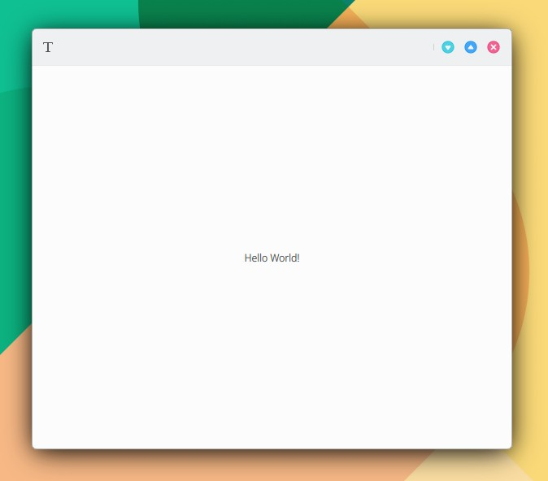

# Conectar funcionalidad C++ con la interfaz QML

```
Backend.introductionText
```

Otra forma de nombrar funcionalidad en otro ejemplo distinto podría ser:

```
Users.list
```

### 1. Añade el siguiente código a un nuevo archivo (KDevelop > File > New) y guardalo en tu aplicación MauiKit en myapp/src/code/backend.h:&#x20;

```
#pragma once

#include <QObject>
#include <QDebug>

class Backend : public QObject
{
    Q_OBJECT
    Q_PROPERTY(QString introductionText READ introductionText WRITE setIntroductionText NOTIFY introductionTextChanged)

public:
    explicit Backend(QObject *parent = nullptr);

public:
    QString introductionText() const;
    void setIntroductionText(const QString &introductionText);
    Q_SIGNAL void introductionTextChanged();

private:
    QString m_introductionText;

private slots:
    void on_IntroductionTextChanged();
};
```

### 2. Añade la implementación a un nuevo archivo en myapp/src/code/backend.cpp:

```
#include "backend.h"

Backend::Backend(QObject *parent)
    : QObject(parent)
{
    connect(this, SIGNAL(introductionTextChanged()), this, SLOT(on_IntroductionTextChanged()));

    m_introductionText = "Hello World!";
}

QString Backend::introductionText() const
{
    return m_introductionText;
}

void Backend::setIntroductionText(const QString &introductionText)
{
    m_introductionText = introductionText;
    Q_EMIT introductionTextChanged();
}

void Backend::on_IntroductionTextChanged()
{
    qDebug() << "entra en slot";
}
```

### 3. Añade en main.cpp:

\#include "backend.h"

### 4. Añade en main.cpp, justo después de la línea "QQmlApplicationEngine engine;":

```
Backend backend;
qmlRegisterSingletonInstance<Backend>("org.kde.myapp", 1, 0, "Backend", &backend);
```

### 5. Añade en myapp/src/CMakeLists.txt:

```
code/backend.cpp
```

```
set(project_SRCS
    code/main.cpp
    assets/assets.qrc
    code/backend.cpp
    )
```


No se confunda con myapp/CMakeLists.txt

El archivo correcto es myapp/src/CMakeLists.txt


### 6. Añada en el fichero qml en el que quiera acceder a la funcionalidad C++ el siguiente código.

Para establecer la conexión entre la funcionalidad C++ y la interfaz QML:

```
import org.kde.myapp 1.0
```

Para leer y escribir:

```
text: Backend.introductionText
Backend.introductionText = "Be happy"
```

En el siguiente ejemplo se añade a **main.qml:**

```
import QtQuick 2.15
import QtQuick.Controls 2.15
import org.mauikit.controls 1.3 as Maui
import org.kde.myapp 1.0

Maui.ApplicationWindow
{
    id: root

    Maui.Page {
        id: page

        anchors.fill: parent
        showCSDControls: true

        headBar.leftContent: ToolButton {
            icon.name: "typewriter"
            flat: true
            onClicked: {
                Backend.introductionText = "Be happy"
            }
        }

        Label {
            anchors.centerIn: parent
            text: Backend.introductionText
        }
    }
}
```

<figure><figcaption></figcaption></figure>

{% embed url="https://files.gitbook.com/v0/b/gitbook-x-prod.appspot.com/o/spaces%2FED1v8xhNFPWKlgOCuryr%2Fuploads%2FCpfvnS9ZEINUtzUKtR1B%2FConectar-C%2B%2B-QML.mp4?alt=media&token=5e2e776c-a6cf-43de-b0cf-f88299153af5" %}

## Pasar múltiples datos en una sola propiedad desde código C++ a la interfaz QML.

En el siguiente ejemplo se crea la propiedad "users" conteniendo "name", "surname", "active" y "age". La propiedad "users" será leída y escrita desde QML.

### 1. Sustituya el paso 1 y añada a myapp/src/code/backend.h

```
#pragma once

#include <QObject>
#include <QDebug>
#include <QVariantList>

class Backend : public QObject
{
    Q_OBJECT
    Q_PROPERTY(QVariantList users READ users WRITE setUsers NOTIFY usersChanged)

public:
    explicit Backend(QObject *parent = nullptr);

public:
    QVariantList users() const;
    void setUsers(const QVariantList &users);
    Q_SIGNAL void usersChanged();

private:
    QVariantList m_users;

private slots:
    void on_UsersChanged();
};
```

### 2. Sustituya el paso 2 y añada a myapp/src/code/backend.cpp

```
#include "backend.h"
#include <QVariantMap>

Backend::Backend(QObject *parent)
    : QObject(parent)
{
    connect(this, SIGNAL(usersChanged()), this, SLOT(on_UsersChanged()));

    QVariantMap user1;
    user1["name"] = "John";
    user1["subname"] = "Candy";
    user1["active"] = "false";
    user1["age"] = 43;

    QVariantMap user2;
    user2["name"] = "Errol";
    user2["subname"] = "Flynn";
    user2["active"] = "false";
    user2["age"] = 50;

    m_users.append(user1);
    m_users.append(user2);
}

QVariantList Backend::users() const
{
    return m_users;
}

void Backend::setUsers(const QVariantList &users)
{
    m_users = users;
    Q_EMIT usersChanged();
}

void Backend::on_UsersChanged()
{
    qDebug() << "entra en slot: user changed";
}
```

En una programación más realista sería parecido a esto:

```
for (int i = 0; i < max; i++) {
    QVariantMap user;
    user["name"] = data1[i];
    user["active"] = data2[i];
    m_users.append(user);
}
```

### 3. Sustituya el paso 6 y añada a main.qml:

```
import QtQuick 2.15
import QtQuick.Controls 2.15
import org.mauikit.controls 1.3 as Maui
import org.kde.myapp 1.0

Maui.ApplicationWindow
{
    id: root

    Maui.Page {
        id: page

        anchors.fill: parent
        showCSDControls: true

        headBar.leftContent: ToolButton {
            icon.name: "typewriter"
            flat: true
            onClicked: {
                var users = Backend.users
                users[0].name = "Johnny"
                Backend.users = users
            }
        }

        Label {
            id: label
            anchors.centerIn: parent
            text: Backend.users[0].name
        }
    }
}
```

{% embed url="https://files.gitbook.com/v0/b/gitbook-x-prod.appspot.com/o/spaces%2FED1v8xhNFPWKlgOCuryr%2Fuploads%2Fy1Mk32MTaWWPtAsBVYFt%2FConectar-C%2B%2B-QML-Mutliples-datos-en-una-propiedad.mp4?alt=media&token=964f6482-ac09-4296-a0f0-1097681c5c42" %}
