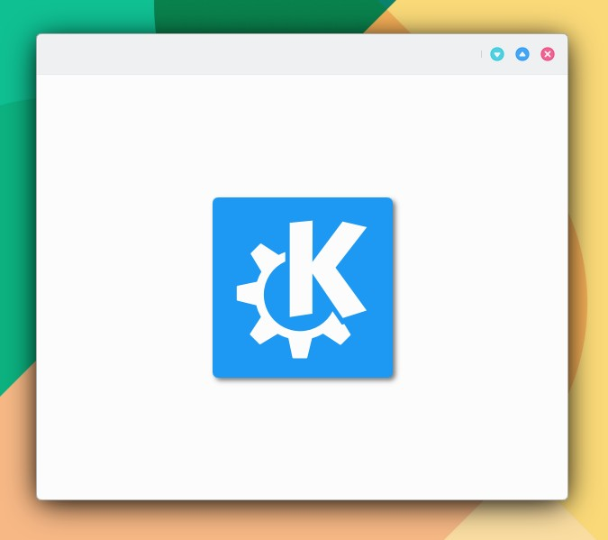
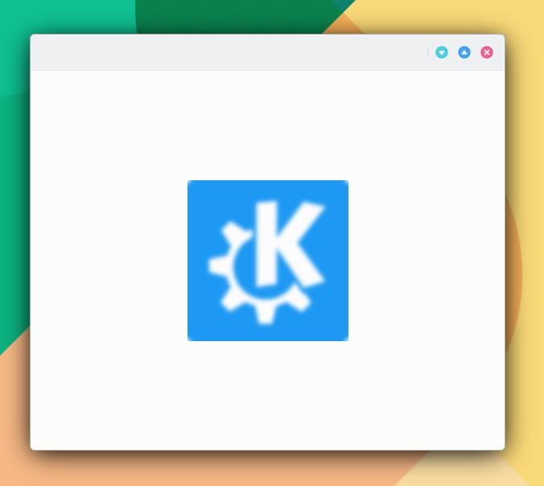

# Efectos

**DropShadow.**

```
import QtQuick 2.15
import QtQuick.Controls 2.15
import org.mauikit.controls 1.3 as Maui
import QtGraphicalEffects 1.15

Maui.ApplicationWindow
{
    id: root

    Maui.Page {
        id: page

        anchors.fill: parent
        showCSDControls: true

        Maui.IconItem
        {
            id: iconItem
            anchors.centerIn: parent
            imageSource: "https://upload.wikimedia.org/wikipedia/commons/8/8d/KDE_logo.svg"
            imageSizeHint: 200
            maskRadius: Maui.Style.radiusV
            fillMode: Image.PreserveAspectCrop

            layer.enabled: true
            layer.effect: DropShadow {
                anchors.fill: iconItem
                horizontalOffset: 3
                verticalOffset: 3
                radius: 8.0
                samples: 17
                color: "#80000000"
                source: iconItem
            }
        }
    }
}

```

<figure><figcaption></figcaption></figure>

**GaussianBlur.**

```
GaussianBlur {
    anchors.fill: iconItem
    source: iconItem
    radius: 8
    samples: 16
}
```

<figure><figcaption></figcaption></figure>

## Tipos

Consulte:



| [Blend](https://doc.qt.io/qt-5/qml-qtgraphicaleffects-blend.html)                           | Merges two source items by using a blend mode                                                      |
| ------------------------------------------------------------------------------------------- | -------------------------------------------------------------------------------------------------- |
| [BrightnessContrast](https://doc.qt.io/qt-5/qml-qtgraphicaleffects-brightnesscontrast.html) | Adjusts brightness and contrast                                                                    |
| [ColorOverlay](https://doc.qt.io/qt-5/qml-qtgraphicaleffects-coloroverlay.html)             | Alters the colors of the source item by applying an overlay color                                  |
| [Colorize](https://doc.qt.io/qt-5/qml-qtgraphicaleffects-colorize.html)                     | Sets the color in the HSL color space                                                              |
| [ConicalGradient](https://doc.qt.io/qt-5/qml-qtgraphicaleffects-conicalgradient.html)       | Draws a conical gradient                                                                           |
| [Desaturate](https://doc.qt.io/qt-5/qml-qtgraphicaleffects-desaturate.html)                 | Reduces the saturation of the colors                                                               |
| [DirectionalBlur](https://doc.qt.io/qt-5/qml-qtgraphicaleffects-directionalblur.html)       | Applies blur effect to the specified direction                                                     |
| [Displace](https://doc.qt.io/qt-5/qml-qtgraphicaleffects-displace.html)                     | Moves the pixels of the source item according to the given displacement map                        |
| [DropShadow](https://doc.qt.io/qt-5/qml-qtgraphicaleffects-dropshadow.html)                 | Generates a soft shadow behind the source item                                                     |
| [FastBlur](https://doc.qt.io/qt-5/qml-qtgraphicaleffects-fastblur.html)                     | Applies a fast blur effect to one or more source items                                             |
| [GammaAdjust](https://doc.qt.io/qt-5/qml-qtgraphicaleffects-gammaadjust.html)               | Alters the luminance of the source item                                                            |
| [GaussianBlur](https://doc.qt.io/qt-5/qml-qtgraphicaleffects-gaussianblur.html)             | Applies a higher quality blur effect                                                               |
| [Glow](https://doc.qt.io/qt-5/qml-qtgraphicaleffects-glow.html)                             | Generates a halo like glow around the source item                                                  |
| [HueSaturation](https://doc.qt.io/qt-5/qml-qtgraphicaleffects-huesaturation.html)           | Alters the source item colors in the HSL color space                                               |
| [InnerShadow](https://doc.qt.io/qt-5/qml-qtgraphicaleffects-innershadow.html)               | Generates a colorized and blurred shadow inside the source                                         |
| [LevelAdjust](https://doc.qt.io/qt-5/qml-qtgraphicaleffects-leveladjust.html)               | Adjusts color levels in the RGBA color space                                                       |
| [LinearGradient](https://doc.qt.io/qt-5/qml-qtgraphicaleffects-lineargradient.html)         | Draws a linear gradient                                                                            |
| [MaskedBlur](https://doc.qt.io/qt-5/qml-qtgraphicaleffects-maskedblur.html)                 | Applies a blur effect with a varying intesity                                                      |
| [OpacityMask](https://doc.qt.io/qt-5/qml-qtgraphicaleffects-opacitymask.html)               | Masks the source item with another item                                                            |
| [RadialBlur](https://doc.qt.io/qt-5/qml-qtgraphicaleffects-radialblur.html)                 | Applies directional blur in a circular direction around the items center point                     |
| [RadialGradient](https://doc.qt.io/qt-5/qml-qtgraphicaleffects-radialgradient.html)         | Draws a radial gradient                                                                            |
| [RectangularGlow](https://doc.qt.io/qt-5/qml-qtgraphicaleffects-rectangularglow.html)       | Generates a blurred and colorized rectangle, which gives the impression that the source is glowing |
| [RecursiveBlur](https://doc.qt.io/qt-5/qml-qtgraphicaleffects-recursiveblur.html)           | Blurs repeatedly, providing a strong blur effect                                                   |
| [ThresholdMask](https://doc.qt.io/qt-5/qml-qtgraphicaleffects-thresholdmask.html)           | Masks the source item with another item and applies a threshold value                              |
| [ZoomBlur](https://doc.qt.io/qt-5/qml-qtgraphicaleffects-zoomblur.html)                     | Applies directional blur effect towards source items center point                                  |
