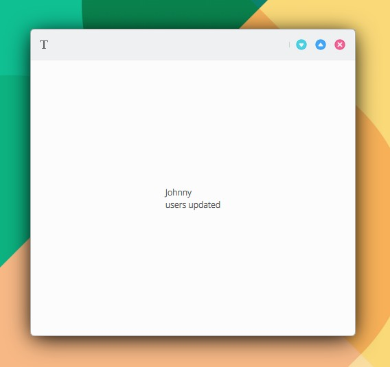
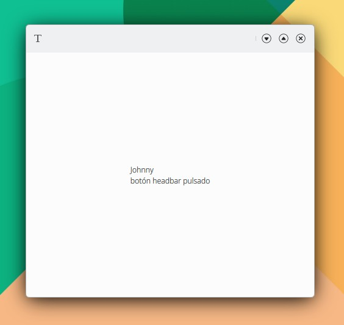

# Enviar señales

## De código C++ a código QML.

Útil para informar el fín de una tarea como instalación terminada o para informar de fin de reproducción de una canción o video.

1\. Siga los pasos de 1 a 5 indicados en:


[conectar-funcionalidad-c++-con-la-interfaz-qml.md](conectar-funcionalidad-c++-con-la-interfaz-qml.md)


sustituyendo el paso 1 y 2 por:

```
// nuevo código en myapp/src/code/backend.h
signals:    
    void updated(QString data);
```

```
//nuevo código en myapp/src/code/backend.cpp
updated("users updated");
```

```
// myapp/src/code/backend.h

#pragma once

#include <QObject>
#include <QDebug>
#include <QVariantList>

class Backend : public QObject
{
    Q_OBJECT
    Q_PROPERTY(QVariantList users READ users WRITE setUsers NOTIFY usersChanged)

public:
    explicit Backend(QObject *parent = nullptr);

public:
    QVariantList users() const;
    void setUsers(const QVariantList &users);
    Q_SIGNAL void usersChanged();

private:
    QVariantList m_users;

private slots:
    void on_UsersChanged();

signals:
    void updated(QString data);
};
```

```
// myapp/src/code/backend.cpp

#include "backend.h"
#include <QVariantMap>

Backend::Backend(QObject *parent)
    : QObject(parent)
{
    connect(this, SIGNAL(usersChanged()), this, SLOT(on_UsersChanged()));

    QVariantMap user1;
    user1["name"] = "John";
    user1["subname"] = "Candy";
    user1["active"] = "false";
    user1["age"] = 43;

    QVariantMap user2;
    user2["name"] = "Errol";
    user2["subname"] = "Flynn";
    user2["active"] = "false";
    user2["age"] = 50;

    m_users.append(user1);
    m_users.append(user2);
}

QVariantList Backend::users() const
{
    return m_users;
}

void Backend::setUsers(const QVariantList &users)
{
    m_users = users;
    Q_EMIT usersChanged();
}

void Backend::on_UsersChanged()
{
    qDebug() << "entra en slot: user changed";

    QVariantMap user = m_users[0].toMap();
    QString name = user["name"].toString();

    qDebug() << name;

    updated("users updated");
}
```

2\. Añada en **main.qml:**

```
Connections {
    target: Backend
    onUpdated: {
        labelUpdated.text = data
        console.info("señal recibida")
    }
}
```

```
import QtQuick 2.15
import QtQuick.Controls 2.15
import org.mauikit.controls 1.3 as Maui
import org.kde.myapp 1.0

Maui.ApplicationWindow
{
    id: root

    Maui.Page {
        id: page

        anchors.fill: parent
        showCSDControls: true

        headBar.leftContent: ToolButton {
            icon.name: "typewriter"
            flat: true
            onClicked: {
                var users = Backend.users
                users[0].name = "Johnny"
                Backend.users = users
            }
        }

        Column {
            anchors.centerIn: parent
            Label {
                id: label
                text: Backend.users[0].name
            }
            Label {
                id: labelUpdated

                Connections {
                    target: Backend
                    onUpdated: {
                        labelUpdated.text = data
                        console.info("señal recibida")
                    }
                }
            }
        }
    }
}
```

<figure><figcaption></figcaption></figure>

## De un componente QML a otro componente QML.

Añada a **main.qml**:

```
signal buttonClicked(string data, int data2)
```

```
page.buttonClicked("botón headbar pulsado","1")
```

```
Connections {
    target: page
    onButtonClicked: {
        labelUpdated.text = data
        console.info("señal recibida")
    }
}
```

```
import QtQuick 2.15
import QtQuick.Controls 2.15
import org.mauikit.controls 1.3 as Maui
import org.kde.myapp 1.0

Maui.ApplicationWindow
{
    id: root

    Maui.Page {
        id: page

        anchors.fill: parent
        showCSDControls: true

        signal buttonClicked(string data, int data2)

        headBar.leftContent: ToolButton {
            icon.name: "typewriter"
            flat: true
            onClicked: {
                var users = Backend.users
                users[0].name = "Johnny"
                Backend.users = users
                page.buttonClicked("botón headbar pulsado","1")
            }
        }

        Column {
            anchors.centerIn: parent
            Label {
                id: label
                text: Backend.users[0].name
            }
            Label {
                id: labelUpdated

                Connections {
                    target: page
                    onButtonClicked: {
                        labelUpdated.text = data
                        console.info("señal recibida")
                    }
                }
            }
        }
    }
}
```

<figure><figcaption></figcaption></figure>

## De un objeto C++ a otro objeto C++.&#x20;

En este ejemplo se añade un hilo asíncrono que permita ejecutar una tarea sin congelar la interfaz de la aplicación. Para este caso se ejecuta simplemente una espera de 5 segundos. Una vez finalice el hilo asíncrono, una señal es enviada del objeto "asyncThread" y recibida en el objeto "backend" por el correspondiente slot.

1\. Siga los pasos de 1 a 5 indicados en:


[conectar-funcionalidad-c++-con-la-interfaz-qml.md](conectar-funcionalidad-c++-con-la-interfaz-qml.md)


2\. Añade el archivo myapp/src/code/async.h

```
// async.h

#ifndef ASYNC_H
#define ASYNC_H

#include <QThread>
#include <QObject>

class Async : public QThread
{
    Q_OBJECT

public:
    Async();
    ~Async();

    void run();

signals:
    void taskCompleted(const int &error);
};

#endif // ASYNC_H
```

3\. Añade el archivo myapp/src/code/async.cpp

<pre><code><strong>// async.cpp
</strong><strong>
</strong><strong>#include "async.h"
</strong>#include &#x3C;QDebug>
#include &#x3C;QtCore>

Async::Async()
{
}

Async::~Async()
{
}

void Async::run()
{
    int error = 0;

    QThread::msleep(5000);

    taskCompleted(error);
}
</code></pre>

3\. Añade a myapp/src/code/backend.h:

```
#include "async.h"
Async asyncThread;
```

```
#pragma once

#include <QObject>
#include <QDebug>
#include <QVariantList>
#include "async.h"

class Backend : public QObject
{
    Q_OBJECT
    Q_PROPERTY(QVariantList users READ users WRITE setUsers NOTIFY usersChanged)

public:
    explicit Backend(QObject *parent = nullptr);

public:
    QVariantList users() const;
    void setUsers(const QVariantList &users);
    Q_SIGNAL void usersChanged();

private:
    QVariantList m_users;
    Async asyncThread;

private slots:
    void on_UsersChanged();
    void on_TaskCompleted(const int &error);

signals:
    void updated(QString data);
};

```

4\. Añade a myapp/src/code/backend.cpp:

```
connect(&asyncThread, SIGNAL(taskCompleted(const int &)),this, SLOT(on_TaskCompleted(const int &)));

asyncThread.start();

void Backend::on_TaskCompleted(const int &error)
{
    qDebug() << "entra en slot: tarea asíncrona completada";
}
```

```
#include "backend.h"
#include <QVariantMap>

Backend::Backend(QObject *parent)
    : QObject(parent)
{
    connect(this, SIGNAL(usersChanged()), this, SLOT(on_UsersChanged()));
    connect(&asyncThread, SIGNAL(taskCompleted(const int &)),this, SLOT(on_TaskCompleted(const int &)));

    QVariantMap user1;
    user1["name"] = "John";
    user1["subname"] = "Candy";
    user1["active"] = "false";
    user1["age"] = 43;

    QVariantMap user2;
    user2["name"] = "Errol";
    user2["subname"] = "Flynn";
    user2["active"] = "false";
    user2["age"] = 50;

    m_users.append(user1);
    m_users.append(user2);

    asyncThread.start();
}

QVariantList Backend::users() const
{
    return m_users;
}

void Backend::setUsers(const QVariantList &users)
{
    m_users = users;
    Q_EMIT usersChanged();
}

void Backend::on_UsersChanged()
{
    qDebug() << "entra en slot: user changed";
}

void Backend::on_TaskCompleted(const int &error)
{
    qDebug() << "entra en slot: tarea asíncrona completada";
}

```

**Resultado**

Compile y ejecute Debug en KDevelop. La salida de Debug en el panel inferior informará tras 5 segundos:

```
entra en slot: tarea asíncrona completada
```
