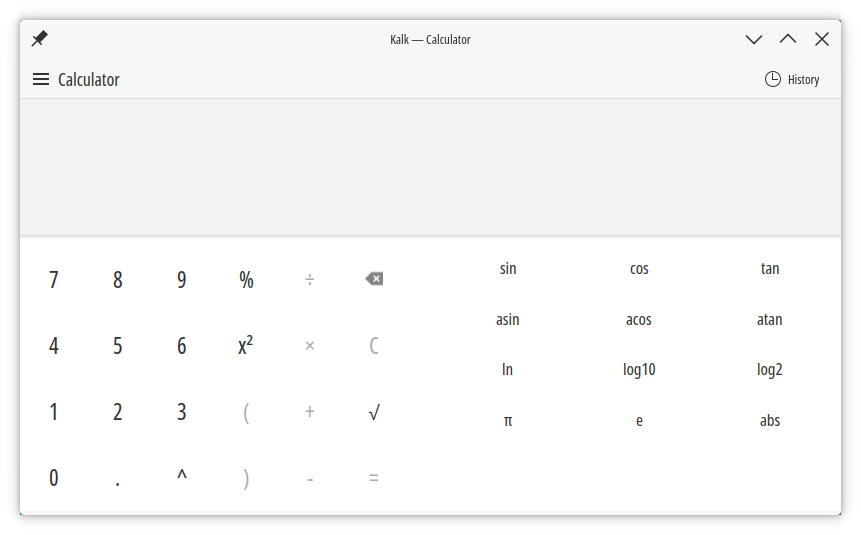

# Kirigami

<figure><figcaption></figcaption></figure>

## Cómo se ven las aplicaciones Kirigami

En KDE las aplicaciones Kirigami siguen el estilo Brisa, pero nada obliga a ello. Es posible usar otros estilos Qt Quick Controls Style creados para Kirigami, aunque ninguno ha sido realizado todavía, o al menos de manera completa.

ControlKit implementa estilo y la aplicación adaptación.

### Calendar es Calindori

<figure><figcaption>
Calindori
</figcaption></figure>

 

<figure><figcaption>
Calendar
</figcaption></figure>





### Calculator es Kalc

<figure><figcaption>
Kalk
</figcaption></figure>

 

<figure><figcaption>
Calculator
</figcaption></figure>





### Más ejemplos


[aplicaciones-kirigami-con-otros-estilos.md](aplicaciones-kirigami-con-otros-estilos.md)


### Estilos Qt Quick Controls

Windows 11 es un estilo interesante para Qt/QML:


[estilo-windows-11-para-qt-quick-controls.md](estilo-windows-11-para-qt-quick-controls.md)


Crear un nuevo estilo siempre es la opción preferente para un mejor resultado. Aun así Qt dispone de Imagine, un estilo que actúa a modo de motor de temas o theme engine.


Estilo Imagine


## Licencias

* CC0-1.0
* LGPL-2.0-or-later
* LGPL-2.1-only
* LGPL-3.0-only

## Enlaces


Página principal de Kirigami



Guía para empezar a crear aplicaciones con Kirigami



Documentación



Documentación de Kirigami



Código fuente de Kirigami



Código fuente de Kirigami Addons

