# Imágenes High Fidelity

<figure>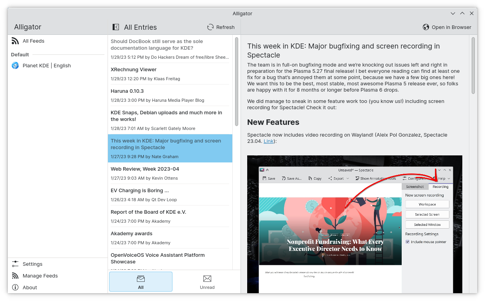<figcaption>
Alligator
</figcaption></figure>

<figure>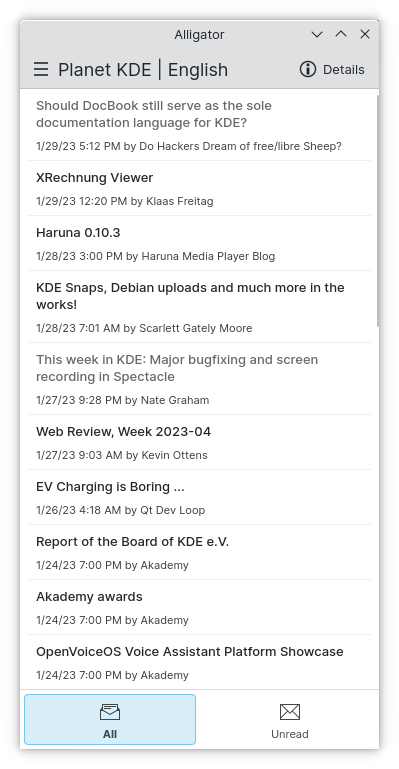<figcaption>
Alligator
</figcaption></figure>

<figure>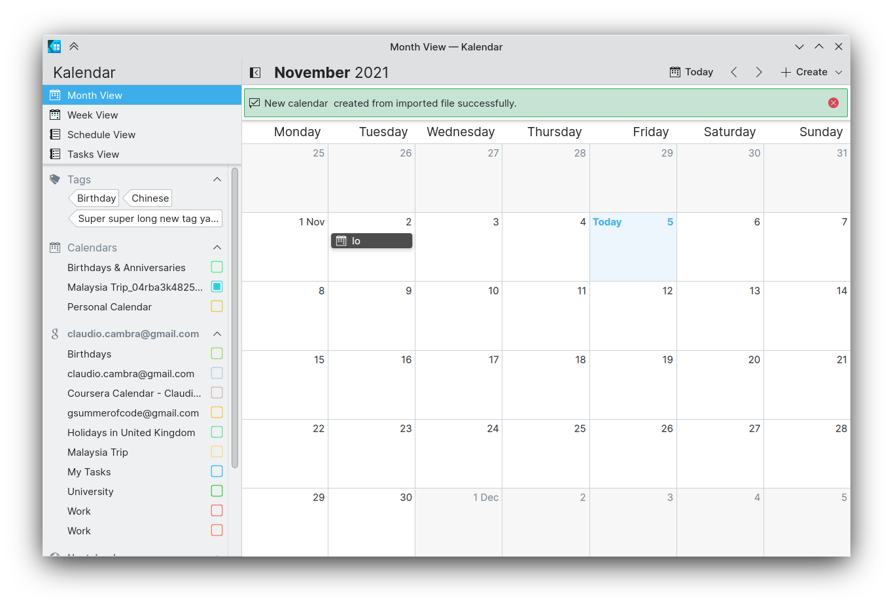<figcaption>
Kalendar
</figcaption></figure>

<figure>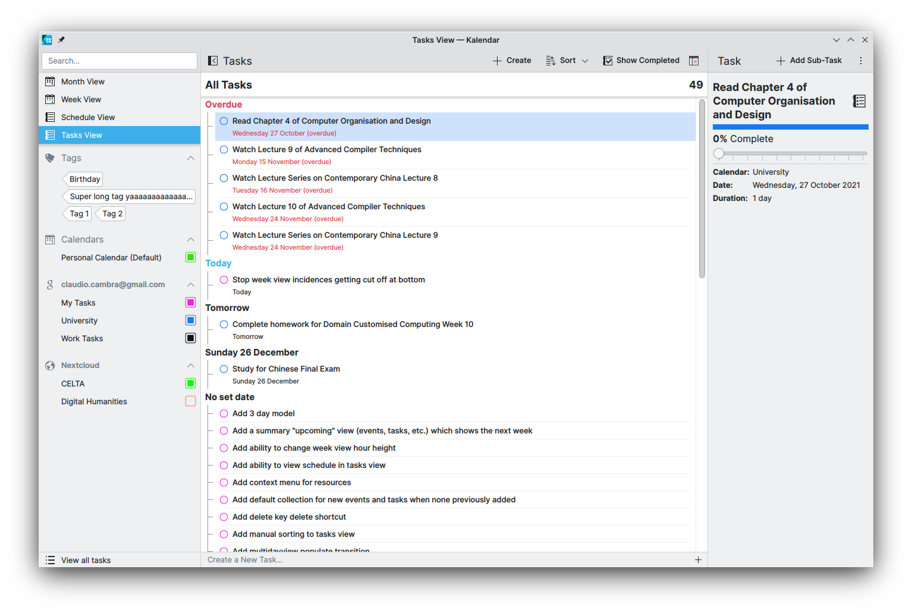<figcaption>
Kalendar
</figcaption></figure>

<figure>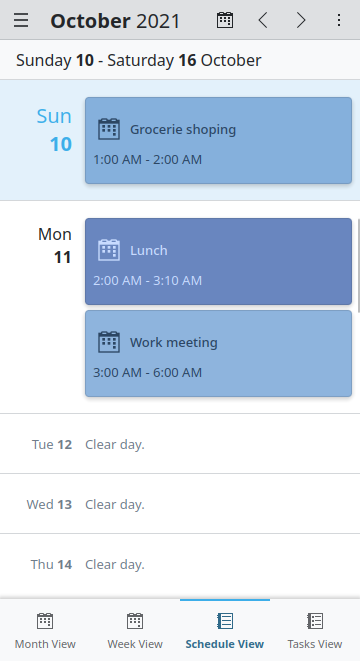<figcaption>
Kalendar
</figcaption></figure>

<figure>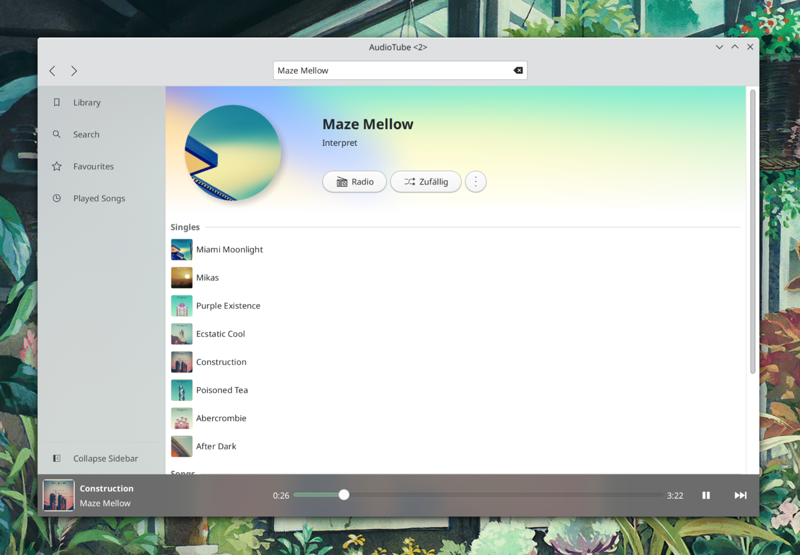<figcaption>
AudioTube
</figcaption></figure>

<figure>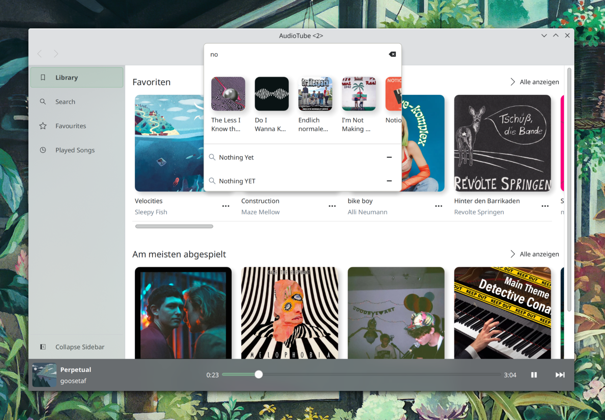<figcaption>
AudioTube
</figcaption></figure>

<figure>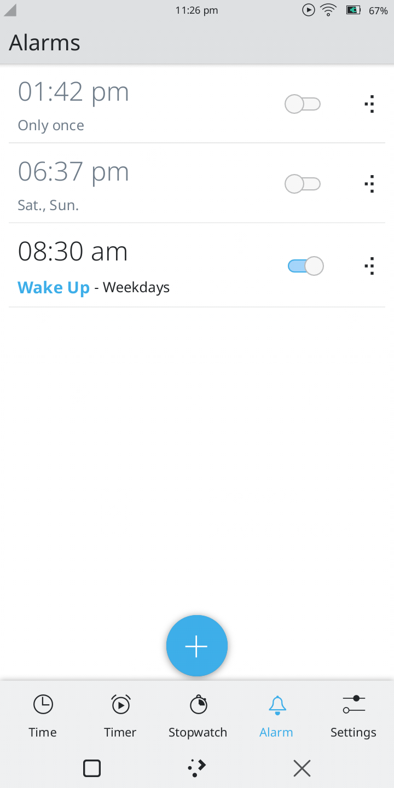<figcaption>
KClock
</figcaption></figure>

<figure>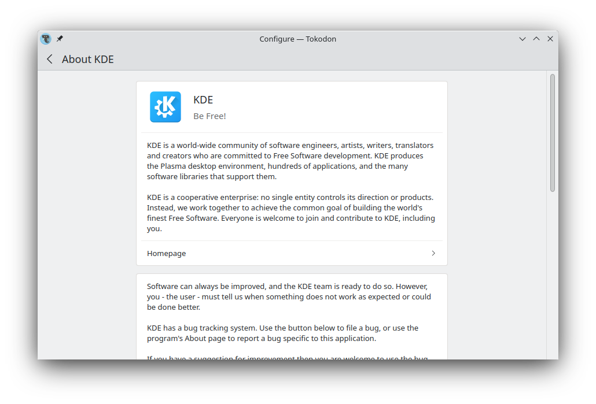<figcaption>
Tokodon mostrando el componente MobileForm.FormCard disponible en Kirigami Addons
</figcaption></figure>

<figure>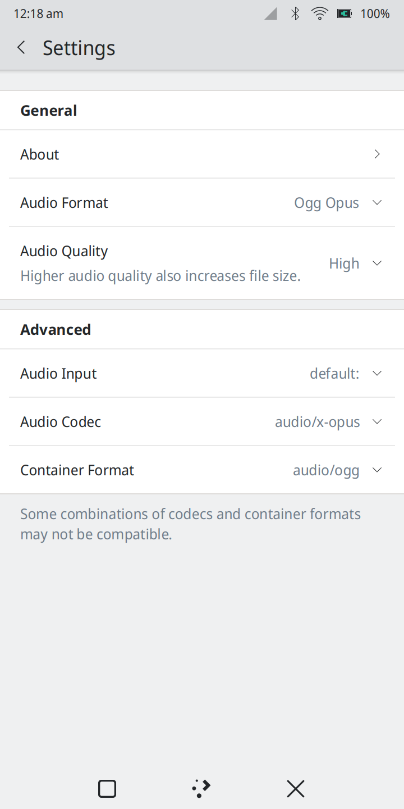<figcaption>
Configuración de KRecorder
</figcaption></figure>

<figure><figcaption>
Configuración de NeoChat
</figcaption></figure>

<figure>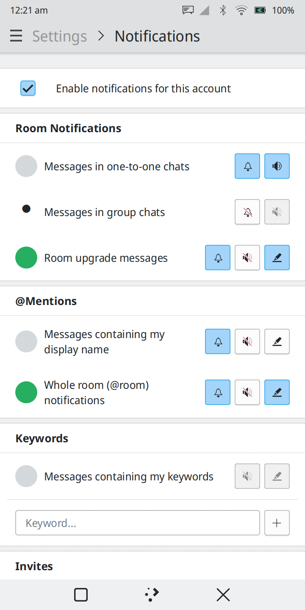<figcaption>
Configuración de NeoChat
</figcaption></figure>

<figure>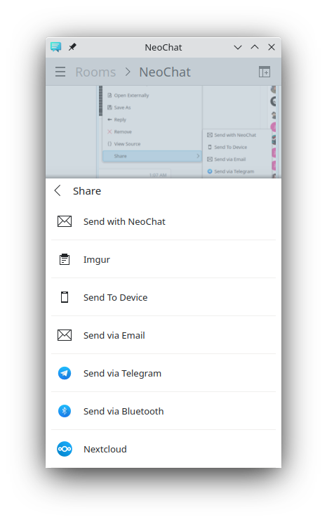<figcaption>
Opción Share de Neochat
</figcaption></figure>

<figure>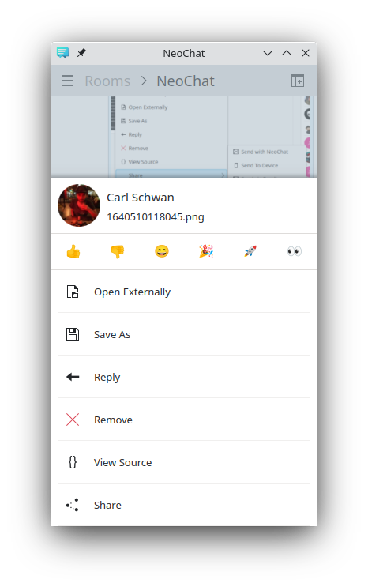<figcaption>
Opción de NeoChat
</figcaption></figure>
