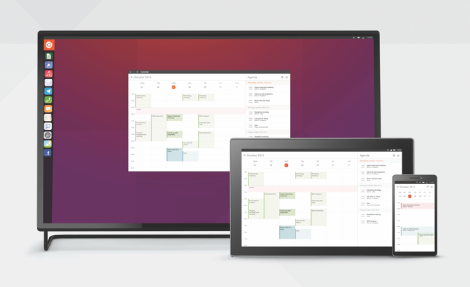

# Lomiri UI Toolkit

<figure><figcaption>
Lomiri / Ubuntu Phone
</figcaption></figure>

Lomiri y Ubuntu Touch son sistemas operativos que alcanzan la convergencia multidispotisitivo, mismo sistema para PCs, móviles, o tablets. Mismas aplicaciones adaptadas a cada dispositivo. Al conectar tu teléfono a una pantalla se muestra el escritorio de PC.

Plasma Mobile sigue un mismo objetivo.

## Lomiri

Es la versión enfocada en el escritorio, para el PC. Anteriormente conocido como Unity 8, usa el servidor MIR que ahora es compatible con Wayland.

## Ubuntu Touch

Más centrada en el móvil, ofrece instalación en dispositivos de marcas:

> Google Pixel 3a/3a XL, Xiaomi Poco X3 NFC, Xiaomi Redmi Note 9S/9 Pro (India), Xiaomi Redmi Note 9 Pro Max, Xiaomi Poco M2 Pro, Xiaomi Mi A2, Xiaomi Redmi Note 9 Pro (Global), BQ Aquaris M10 HD, BQ Aquaris M, 10 FHD, Fairphone 3 and 3+, Asus Zenfone Max Pro M1, Oneplus 5, Oneplus 5T, Oneplus One, Bq Aquaris E5 HD, JingLing JingPad A1/C1, Meizu Pro 5, Volla Phone, Volla Phone X, Sony Xperia X (F5121 & F5122), OnePlus 6, OnePlus 6T, Fairphone 2, Meizu MX4, Xiaomi Redmi 9C, Xiaomi Redmi 9A, Google Nexus 5, Lenovo Tab M10 X605F/L, Xiaomi Mi 6, Xiaomi Redmi 9C NFC, Volla Phone 22, Xiaomi Redmi Note 7 Pro, Xiaomi Poco F1, Xiaomi Redmi 4X, Fairphone 4, Samsung S3 Neo+ (GT-I9301I), Xiaomi Mi MIX 3, Xiaomi Redmi Note 8 Pro, Xiaomi Redmi Note 7, Google Pixel 2XL, Google Pixel 2, Xiaomi Mi 8, Xiaomi Redmi 9 and 9 Prime, Oneplus 3 and 3T, Samsung Galaxy S7 Edge (Exynos), Samsung Galaxy S7 (Exynos), Xiaomi Mi A3, Google Nexus 6P, Xiaomi Redmi Note 9, OnePlus Nord 2 5G, Xiaomi Redmi 7, SHIFT6mq (axolotl), Oneplus 2, Xiaomi Poco M3, Sony Xperia Z4 Tablet (LTE or Wi-fi only), Xiaomi Redmi 3X, 3S y 3SP

<table data-card-size="large" data-view="cards"><thead><tr><th></th><th data-hidden data-card-cover data-type="files"></th></tr></thead><tbody><tr><td>Guías de diseño disponibles</td><td><a href="../../.gitbook/assets/Ubuntu-Touch-Design-2.png">Ubuntu-Touch-Design-2.png</a></td></tr><tr><td></td><td><a href="../../.gitbook/assets/Ubuntu-Touch-Design-4.png">Ubuntu-Touch-Design-4.png</a></td></tr></tbody></table>

## LGPL 3

Añade permisos adicionales sobre la licencia GPL 3.

## Enlaces


Aplicaciones para Ubuntu Touch y Lomiri



Lomiri UI Toolkit



API de Ubuntu Touch



Guías de diseño para aplicaciones construidas con Lomiri UI Toolkit



Conceptos de diseño



Desarrolladores de Ubuntu Touch



Ubuntu Touch



Lomiri


