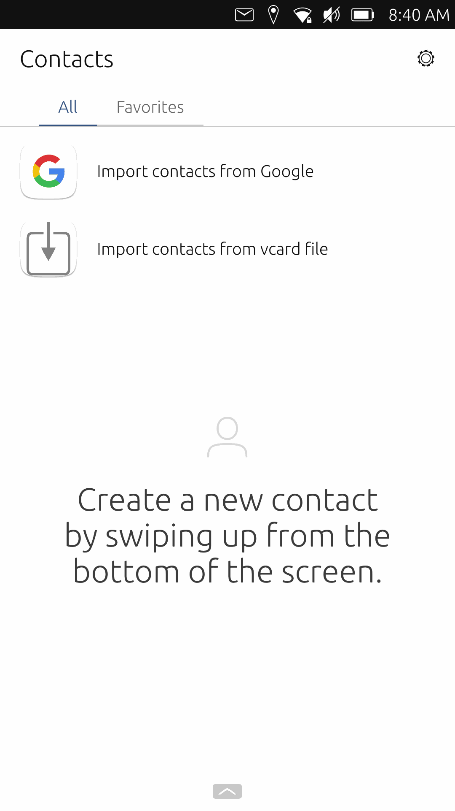

# Imágenes High Fidelity

<figure><figcaption>
Configuración
</figcaption></figure>

<figure><figcaption>
Dekko es un cliente de correo
</figcaption></figure>

<figure><figcaption>
Contactos
</figcaption></figure>

<figure><figcaption>
Contactos
</figcaption></figure>

<figure><figcaption>
Diálogo "Abrir con"
</figcaption></figure>

<figure><figcaption>
Configuración
</figcaption></figure>

<figure><figcaption>
Nuevo contacto
</figcaption></figure>

<figure><figcaption></figcaption></figure>

