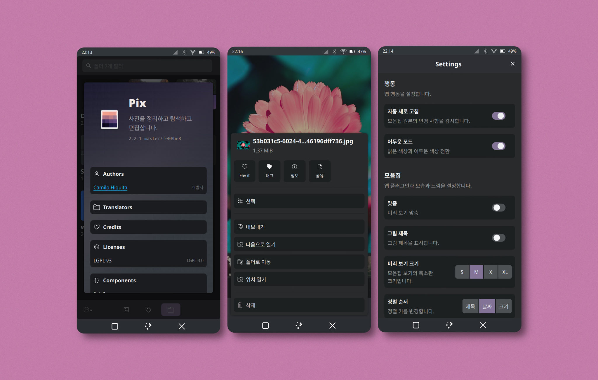
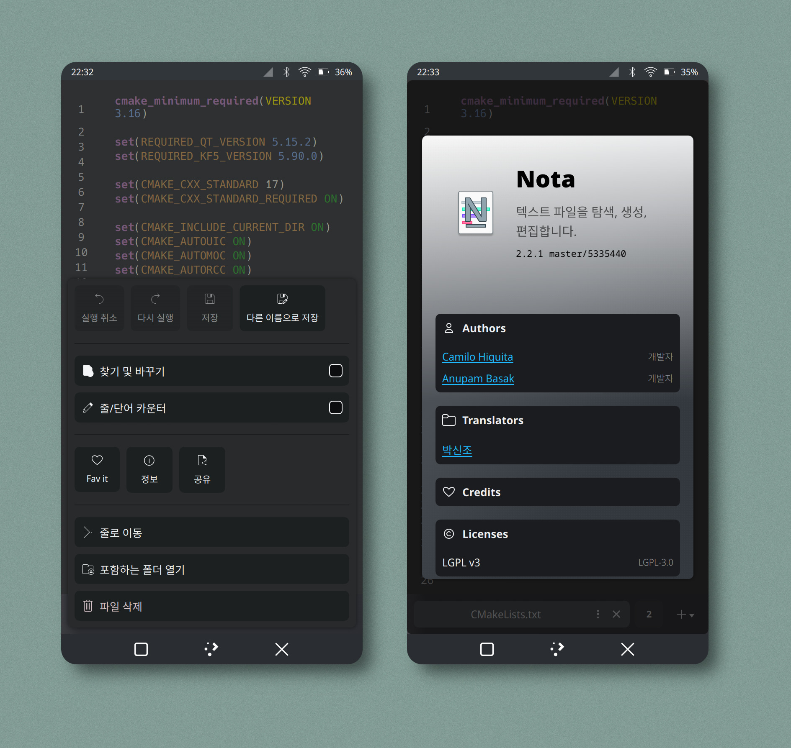
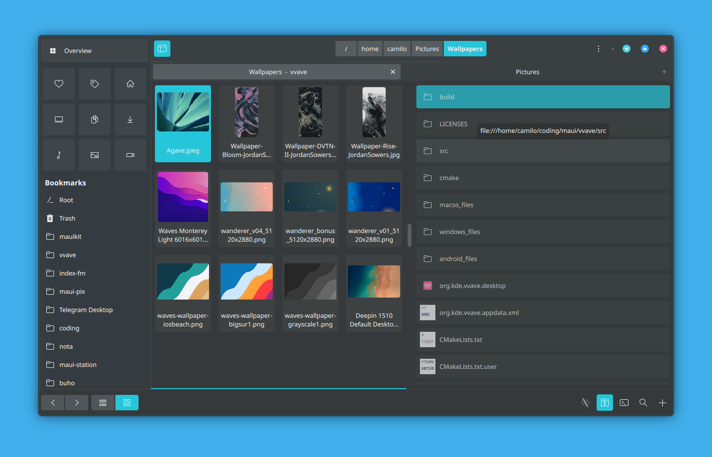
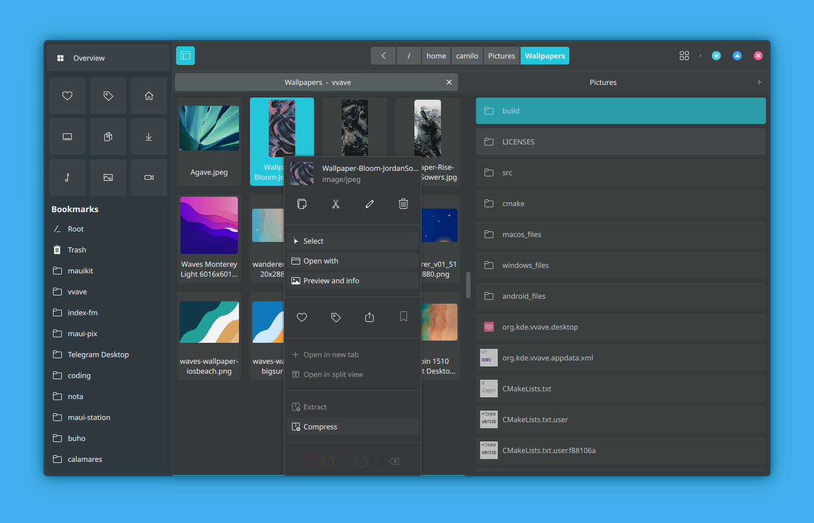
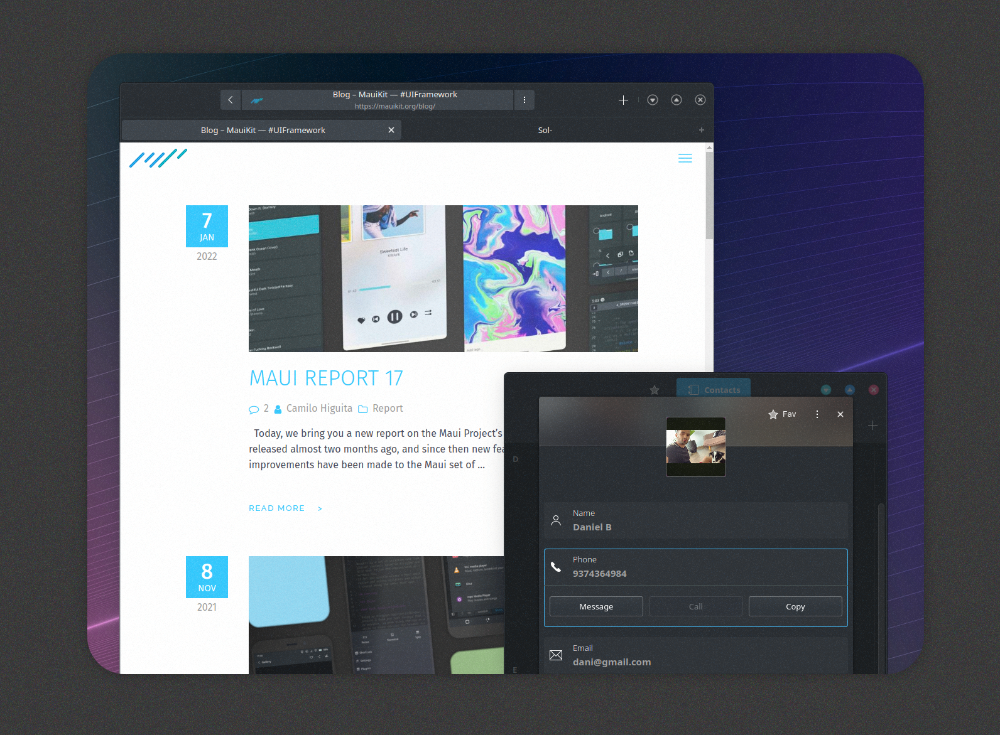

# Imágenes High Fidelity

<figure><figcaption>
Pix
</figcaption></figure>

<figure><figcaption>
Agenda
</figcaption></figure>

<figure><figcaption>
Strike
</figcaption></figure>

<figure><figcaption>
Nota
</figcaption></figure>

<figure><figcaption>
Bonsai
</figcaption></figure>

<figure><figcaption>
Index
</figcaption></figure>

<figure><figcaption>
Index
</figcaption></figure>

<figure><figcaption>
NX Software Center
</figcaption></figure>

<figure><figcaption>
Fiery
</figcaption></figure>
